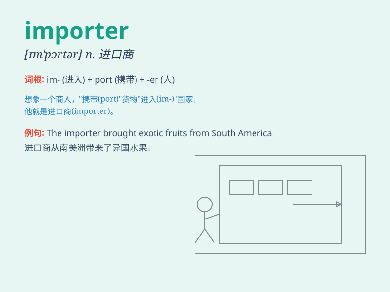

## importer

**英音:** _[ɪmˈpɔːtə(r)]_ **美音:** _[ɪmˈpɔːrtər]_

**译义:** *n.输入者,进口商*

### 短语

+ **major importer:** _主要进口商_

+ **leading importer:** _主要进口国；领先的进口商_

+ **net importer:** _净进口国_

+ **active importer:** _活跃的进口商_

+ **food importer:** _食品进口商_

### 例句

#### 例句1

> **The importer is negotiating a deal with the foreign supplier.**

**中文翻译:** 进口商正在与外国供应商就一项交易进行谈判。

**单词释义:** 进口商

#### 例句2

> **Our company has become a major importer of electronic
products.**

**中文翻译:** 我公司已成为电子产品的主要进口商。

**单词释义:** 进口商

#### 例句3

> **The importer faced challenges due to changes in trade
policies.**

**中文翻译:** 由于贸易政策的变化，进口商面临挑战。

**单词释义:** 进口商

### 背诵小故事

>
想象一下，有个叫小明的商人，他总是从国外引进各种新奇的商品，大家都叫他
importer 小明。因为他把外国的好东西带进国内，所以 importer
就是进口商、进口者的意思。

**想象一下，有个叫小明的商人，他总是从国外引进各种新奇的商品，大家都叫他进口商小明。因为他把外国的好东西带进国内，所以
importer 就是进口商、进口者的意思。**

### 图义

