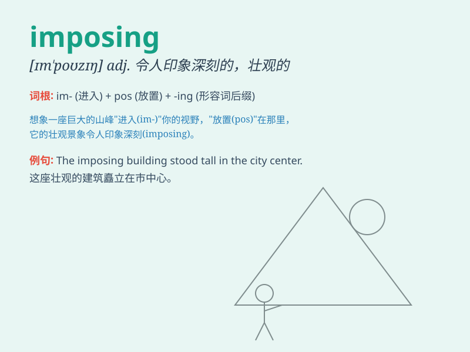

## imposing

**英音:** _[ɪm\'pəʊzɪŋ]_ **美音:** _[ɪm\'pozɪŋ]_

**译义:** *adj.使人难忘的,壮丽的*

### 短语

+ **imposing building:** _宏伟的建筑_

+ **imposing figure:** _威严的人物_

+ **imposing presence:** _令人难忘的仪态_

+ **imposing manner:** _威严的态度_

+ **imposing scenery:** _壮观的景色_

### 例句

#### 例句1

> **The imposing building dominated the city skyline.**

**中文翻译:** 雄伟的建筑占据了城市的天际线。

**单词释义:** 宏伟的；壮观的

#### 例句2

> **He has an imposing presence that commands respect.**

**中文翻译:** 他有一种令人敬畏的气势。

**单词释义:** 令人敬畏的

#### 例句3

> **The imposing mountains provided a breathtaking backdrop for the
village.**

**中文翻译:** 雄伟的山脉为村庄提供了令人惊叹的背景。

**单词释义:** 雄伟的

### 背诵小故事

>
想象一下，有一座古老的城堡，高大的城墙和雄伟的塔楼让人感到震撼。这座城堡给人的印象就是
imposing 。它外表宏伟壮观，令人望而生畏，仿佛在展示着它的威严和力量。

**想象一座令人震撼、外表宏伟壮观、威严有力的城堡来辅助记忆'imposing'（壮观的；使人印象深刻的）这个单词**

### 图义

