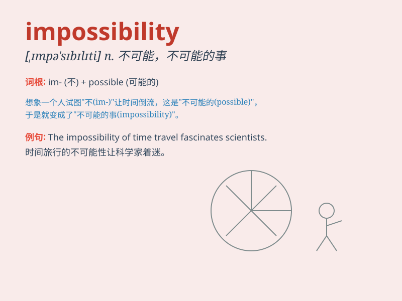

## impossibility

**英音:** _[ɪm,pɒsɪ\'bɪlɪtɪ]_ **美音:**
_[ɪm,pɑsə\'bɪləti]_

**译义:** *n.不可能之事,不可能*

### 短语

+ **the impossibility of doing sth:** _做某事的不可能性_

+ **impossibility to achieve:** _无法达成_

+ **rule out impossibility:** _排除不可能的情况_

+ **face the impossibility:** _面对不可能_

+ **consider the impossibility:** _考虑不可能的事_

### 例句

#### 例句1

> **The idea of time travel has long been considered an
impossibility.**

**中文翻译:** 时间旅行的想法长期以来一直被认为是不可能的。

**单词释义:** 不可能的事

#### 例句2

> **The engineering task seemed like an impossibility, but they
managed to complete it.**

**中文翻译:** 这项工程任务看似不可能，但他们还是成功完成了。

**单词释义:** 不可能的事；不可能

#### 例句3

> **Flying without wings is an impossibility for humans.**

**中文翻译:** 没有翅膀，飞行对人类来说是不可能的。

**单词释义:** 不可能；不可能的事

### 背诵小故事

> One day, a brave adventurer was determined to achieve a seemingly
\'impossibility\' - climbing to the top of the highest and most
dangerous mountain. Despite all the difficulties and doubts, he refused
to give up.

**有一天，一位勇敢的冒险家决心要完成一项看似"不可能的事"------爬上最高且最危险的山峰。尽管困难重重、质疑不断，他都拒绝放弃。**

### 图义

