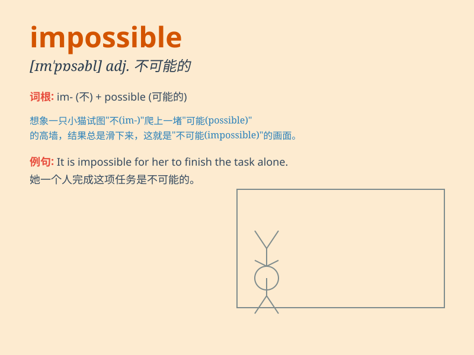

## impossible

**英音:** _[ɪm\'pɒsɪb(ə)l]_ **美音:** _[ɪm\'pɑsəbl]_

**译义:** *adj.不可能的,不会发生的,难以忍受的*

### 短语

+ **impossible dream:** _不可能实现的梦想_

+ **impossible task:** _不可能完成的任务_

+ **seem impossible:** _看起来不可能_

+ **impossible situation:** _不可能的情况_

+ **absolutely impossible:** _绝对不可能_

### 例句

#### 例句1

> **It is impossible for me to finish this task alone.**

**中文翻译:** 我一个人不可能完成这个任务。

**单词释义:** 不可能的

#### 例句2

> **The math problem seemed impossible to solve.**

**中文翻译:** 这道数学题似乎无法解决。

**单词释义:** 不可能的

#### 例句3

> **Nothing is impossible if you put your heart into it.**

**中文翻译:** 只要你用心去做，没有什么是不可能的。

**单词释义:** 不可能的

### 背诵小故事

> 有一天，小明想要飞起来，但大家都告诉他这是 impossible
的。因为没有翅膀，违背了自然规律。小明最终明白，impossible
就是那些根本无法做到，没有可能性的事情。

**有一天，小明想要飞起来，但大家都告诉他这是不可能的。因为没有翅膀，违背了自然规律。小明最终明白，不可能就是那些根本无法做到，没有可能性的事情。**

### 图义

