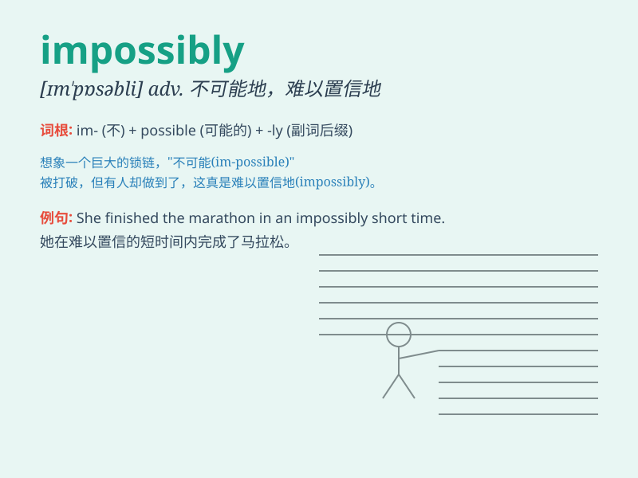

## impossibly

**英音:** _[ɪm\'pɒsəbli]_ **美音:** _[ɪm\'pɒsəbli]_

**译义:** *adv.不可能地,无法可想*

### 短语

+ **impossibly difficult:** _难到不可能_

+ **impossibly high:** _高得离谱_

+ **impossibly beautiful:** _美到不可思议_

+ **impossibly early:** _早得不像话_

+ **impossibly complex:** _复杂到无法想象_

### 例句

#### 例句1

> **The task is impossibly difficult.**

**中文翻译:** 这项任务极其困难。

**单词释义:** 极其困难地；不可能地

#### 例句2

> **She is impossibly beautiful.**

**中文翻译:** 她美得难以置信。

**单词释义:** 难以置信地；极其

#### 例句3

> **He spoke impossibly fast.**

**中文翻译:** 他说得快得令人难以置信。

**单词释义:** 不可思议地；极端地

### 背诵小故事

> A brave adventurer was told it was impossibly to reach the hidden
treasure. But he refused to believe and kept going. Finally, he found
the treasure, proving that what seemed impossibly could be possible with
determination.

**一位勇敢的冒险家被告知不可能找到隐藏的宝藏。但他拒绝相信，继续前行。最终，他找到了宝藏，证明了看似不可能的事，只要有决心就能成为可能。**

### 图义

