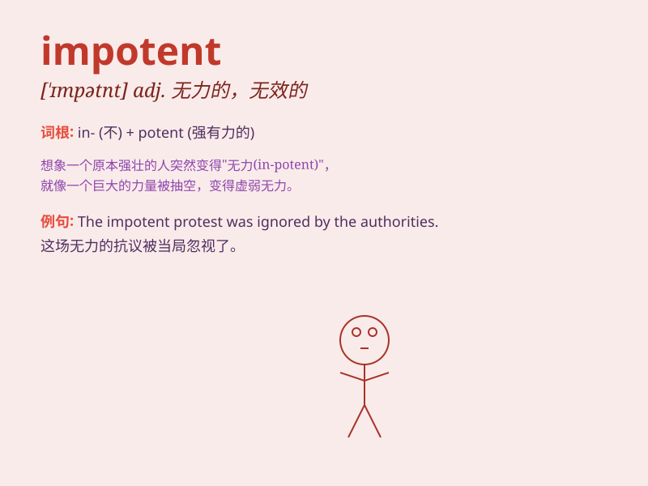

## impotent

**英音:** _[\'ɪmpət(ə)nt]_ **美音:** _[\'ɪmpətənt]_

**译义:** *adj.无力的,虚弱的,无效的,[医]阳萎的*

### 短语

+ **impotent rage:** _无可奈何的愤怒_

+ **impotent man:** _性无能的男人_

+ **impotent to act:** _无力行动_

+ **feel impotent:** _感到无能为力_

+ **impotent attempt:** _无效的尝试_

### 例句

#### 例句1

> **The old man felt impotent in the face of his illness.**

**中文翻译:** 老人面对自己的病痛感到无能为力。

**单词释义:** 无能为力的；虚弱的

#### 例句2

> **The team was impotent to stop the opposing team\'s attack.**

**中文翻译:** 球队无力阻止对方的进攻。

**单词释义:** 无力的；无效的

#### 例句3

> **He became impotent with rage when he heard the news.**

**中文翻译:** 当他听到这个消息时，他愤怒得无能为力。

**单词释义:** 无法控制的；失控的

### 背诵小故事

> A king was impotent when it came to protecting his kingdom. He had no
power or ability to fight off invaders. This made him feel very
frustrated and helpless. Remember, \'impotent\' means powerless or
unable.

**一位国王在保护他的王国时无能为力。他没有力量或能力击退侵略者。这让他感到非常沮丧和无助。记住，\'impotent\'意思是无能为力的或无能力的。**

### 图义

