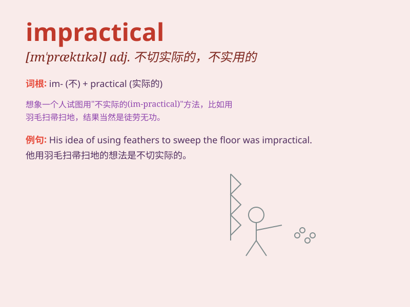

## impractical

**英音:** _[ɪm\'præktɪk(ə)l]_ **美音:** _[ɪm\'præktɪkl]_

**译义:** *adj.不切实际的,昧于实际的*

### 短语

+ **be impractical:** _是不切实际的_

+ **impractical idea:** _不切实际的想法_

+ **impractical plan:** _不切实际的计划_

+ **impractical proposal:** _不切实际的提议_

+ **impractical dream:** _不切实际的梦想_

### 例句

#### 例句1

> **It\'s impractical to expect everyone to work overtime every
day.**

**中文翻译:** 期望每个人每天都加班是不切实际的。

**单词释义:** 不切实际的

#### 例句2

> **This design is impractical for our daily use.**

**中文翻译:** 这种设计对于我们的日常使用来说是不切实际的。

**单词释义:** 不实用的

#### 例句3

> **His plan sounds good but is completely impractical.**

**中文翻译:** 他的计划听起来不错，但完全不切实际。

**单词释义:** 不切实际的

### 背诵小故事

> A man had a wild idea of building a castle in the sky. Everyone said
it was impractical. But he insisted. Eventually, he failed and realized
his plan was not based on reality.

**一个男人有个疯狂的想法，要在天空中建造一座城堡。每个人都说这是不切实际的。但他坚持。最终，他失败了，意识到他的计划不是基于现实的。**

### 图义

