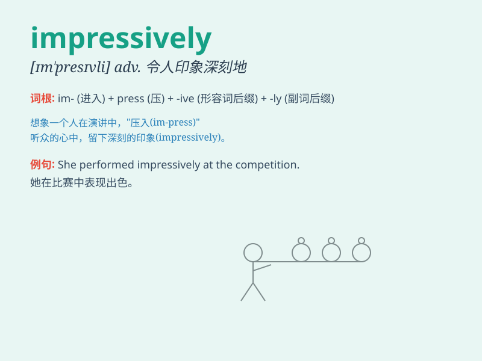

## impressively

**英音:** _[ɪm\'presɪvli]_ **美音:** _[ɪm\'presɪvli]_

**译义:** *adv.令人难忘地*

### 短语

+ **impressively beautiful:** _令人印象深刻地美丽_

+ **impressively large:** _令人印象深刻地大_

+ **impressively performed:** _令人印象深刻地表现_

+ **impressively designed:** _令人印象深刻地设计_

+ **impressively intelligent:** _令人印象深刻地聪明_

### 例句

#### 例句1

> **The athlete performed impressively in the competition.**

**中文翻译:** 这位运动员在比赛中表现出色。

**单词释义:** 令人印象深刻地

#### 例句2

> **The new building was designed impressively.**

**中文翻译:** 新建筑的设计令人印象深刻。

**单词释义:** 令人印象深刻地

#### 例句3

> **She sang impressively at the concert.**

**中文翻译:** 她在演唱会上的演唱令人印象深刻。

**单词释义:** 令人印象深刻地

### 背诵小故事

> A young artist performed on the stage impressively. Everyone was
deeply attracted by his wonderful show. His talent and confidence left a
lasting impression.

**一位年轻的艺术家在舞台上的表演令人印象深刻。每个人都被他精彩的演出深深吸引。他的才华和自信给人留下了持久的印象。**

### 图义

