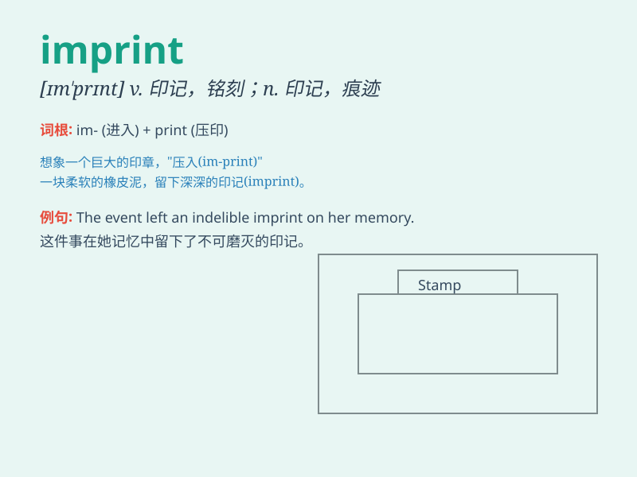

## imprint

**英音:** _[ɪm\'prɪnt]_ **美音:** _[\'ɪmprɪnt]_

**译义:** *v.留下烙印*

### 短语

+ **imprint on:** _给......留下深刻印象_

+ **imprint in:** _印在......里；铭记在......_

+ **mental imprint:** _心理印记_

+ **lasting imprint:** _持久的印记_

+ **imprint memory:** _铭记记忆_

### 例句

#### 例句1

> **The event left a deep imprint on her memory.**

**中文翻译:** 这件事在她的记忆中留下了深刻的印记。

**单词释义:** 印记；痕迹

#### 例句2

> **The company\'s logo is imprinted on all its products.**

**中文翻译:** 该公司的标志印在其所有产品上。

**单词释义:** 印；铭刻

#### 例句3

> **His words imprinted themselves on my mind.**

**中文翻译:** 他的话深深地印在我的脑海里。

**单词释义:** 使铭记；使留下深刻印象

### 背诵小故事

> A little bird fell on a fresh piece of paper and left an imprint. The
paper was like a blank canvas, and the imprint was a unique mark. It
made us remember the moment when the bird touched it.

**一只小鸟落在一张崭新的纸上并留下了印记。这张纸就像一张空白的画布，而这个印记是独特的标记。它让我们记住了小鸟触碰它的那一刻。**

### 图义

