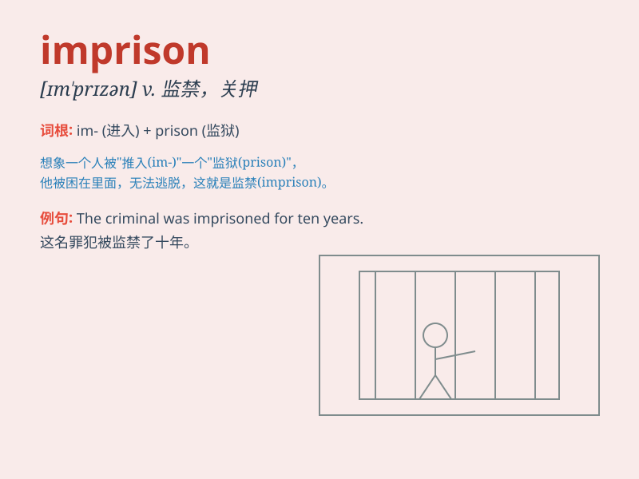

## imprison

**英音:** _[ɪm\'prɪz(ə)n]_ **美音:** _[ɪm\'prɪzn]_

**译义:** *vt.监禁,关押v.监禁*

### 短语

+ **imprison someone for life:** _终身监禁某人_

+ **be imprisoned without trial:** _未经审判被监禁_

+ **imprison illegally:** _非法监禁_

+ **imprison mentally:** _精神上禁锢_

+ **imprison in a cage:** _关在笼子里_

### 例句

#### 例句1

> **The dictator imprisoned all his political opponents.**

**中文翻译:** 独裁者监禁了他所有的政治对手。

**单词释义:** 监禁

#### 例句2

> **He was imprisoned for stealing.**

**中文翻译:** 他因偷窃而入狱。

**单词释义:** 监禁

#### 例句3

> **The criminal was imprisoned for life.**

**中文翻译:** 该罪犯被终身监禁。

**单词释义:** 监禁

### 背诵小故事

> A brave detective was chasing a criminal. But the criminal was very
smart and set a trap. The detective got caught and was imprisoned in a
dark room. Poor detective!

**一位勇敢的侦探在追捕一名罪犯。但罪犯非常聪明并设下了陷阱。侦探被抓住并被监禁在一个黑暗的房间里。可怜的侦探！**

### 图义

