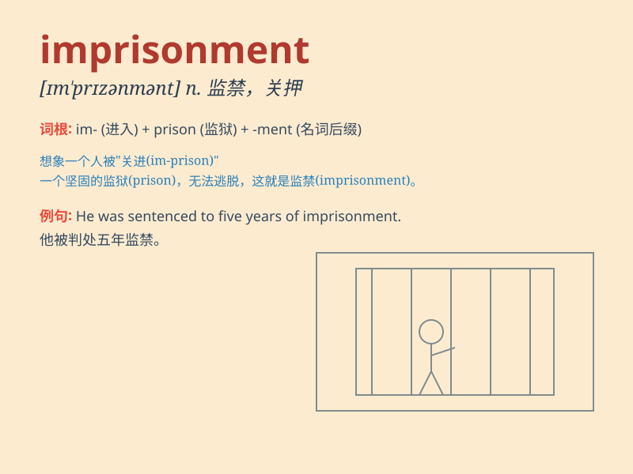

## imprisonment

**英音:** _[ɪm\'prɪz(ə)nm(ə)nt]_ **美音:**
_[ɪm\'prɪznmənt]_

**译义:** *n.关押*

### 短语

+ **life imprisonment:** _无期徒刑_

+ **sentence of imprisonment:** _监禁判决_

+ **avoid imprisonment:** _避免监禁_

+ **serve imprisonment:** _服刑_

+ **term of imprisonment:** _监禁期限_

### 例句

#### 例句1

> **He was sentenced to five years\' imprisonment for fraud.**

**中文翻译:** 他因诈骗罪被判处五年有期徒刑。

**单词释义:** 监禁；坐牢

#### 例句2

> **The threat of imprisonment did not deter him from committing the
crime.**

**中文翻译:** 监禁的威胁并没有阻止他犯罪。

**单词释义:** 监禁；坐牢

#### 例句3

> **She faced imprisonment if she failed to pay the fine.**

**中文翻译:** 如果她不缴纳罚款，她将面临监禁。

**单词释义:** 监禁；坐牢

### 背诵小故事

> A brave detective was chasing a criminal. The criminal was finally
caught and got imprisonment. But the detective didn\'t stop, he
continued to protect the city from more crimes. Imprisonment means the
state of being imprisoned.

**一位勇敢的侦探正在追捕一名罪犯。罪犯最终被抓获并被监禁。但侦探并未停歇，继续守护城市免受更多犯罪侵害。Imprisonment
意思是监禁的状态。**

### 图义

