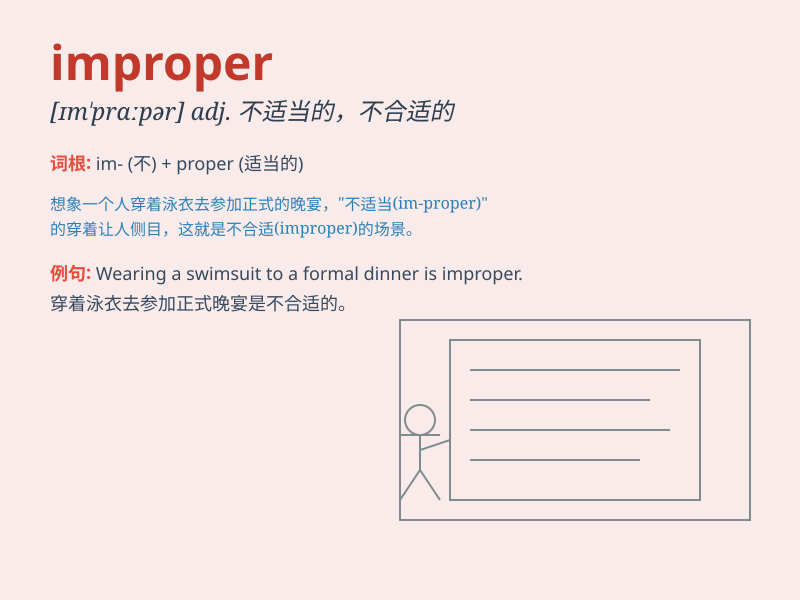

## improper

**英音:** _[ɪm\'prɒpə]_ **美音:** _[ɪm\'prɑpɚ]_

**译义:** *adj.不适当的,不合适的,不正确的,不合礼仪的,不适宜*

### 短语

+ **improper behavior:** _不当行为_

+ **improper use:** _不当使用_

+ **improper diet:** _不当饮食_

+ **improper conduct:** _不当举止_

+ **improper language:** _不当语言_

### 例句

#### 例句1

> **It is improper to laugh at others\' mistakes.**

**中文翻译:** 嘲笑别人的错误是不恰当的。

**单词释义:** 不恰当的；不合适的

#### 例句2

> **He was accused of improper conduct during the meeting.**

**中文翻译:** 他被指控在会议期间行为不当。

**单词释义:** 不当的；不正确的

#### 例句3

> **Wearing such revealing clothes to a formal event is improper.**

**中文翻译:** 穿这种暴露的衣服去正式场合是不合适的。

**单词释义:** 不合适的；不合礼仪的

### 背诵小故事

> A king was very angry because his servants always did improper
things. For example, they served food in a messy way. The king shouted,
\'This is improper!\' meaning not correct or suitable.

**一位国王非常生气，因为他的仆人总是做不恰当的事。比如，他们上菜的方式很杂乱。国王大喊：'这是不恰当的！'意思是不正确或不合适。**

### 图义

