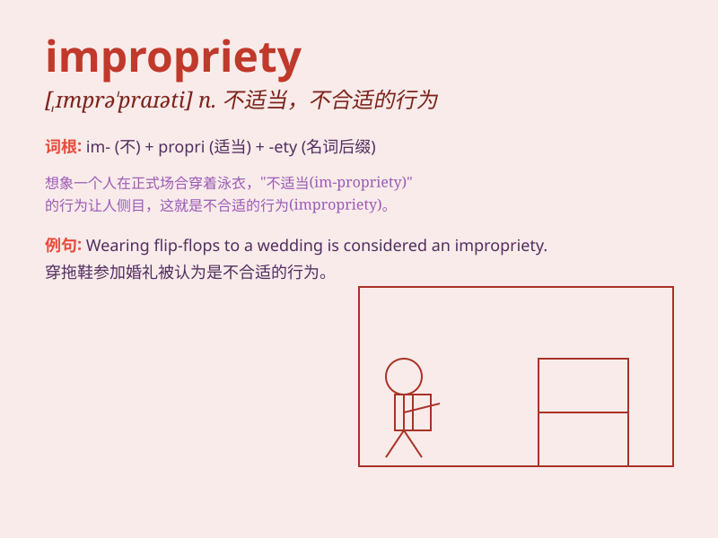

## impropriety

**英音:** _[,ɪmprə\'praɪətɪ]_ **美音:**
_[,ɪmprə\'praɪəti]_

**译义:** *n.不适当,不适当的事物*

### 短语

+ **financial impropriety:** _财务不当行为_

+ **ethical impropriety:** _道德不当_

+ **alleged impropriety:** _被指控的不当行为_

+ **minor impropriety:** _轻微的不当行为_

+ **serious impropriety:** _严重的不当行为_

### 例句

#### 例句1

> **The company was accused of financial impropriety.**

**中文翻译:** 这家公司被指控财务不当。

**单词释义:** 不当行为；不正当；不合适

#### 例句2

> **He was dismissed for impropriety in his conduct.**

**中文翻译:** 他因行为不当被解雇。

**单词释义:** 不当；不合适

#### 例句3

> **The investigation revealed several improprieties in the election
process.**

**中文翻译:** 调查揭示了选举过程中的几处不当行为。

**单词释义:** 不正当行为；不当之处

### 背诵小故事

> A company\'s boss found some impropriety in the financial reports. It
turned out an employee had made mistakes in recording expenses. This
incident made everyone realize the importance of accuracy and honesty.

**一家公司的老板在财务报告中发现了一些不当行为。原来是一名员工在记录费用时犯了错误。这一事件让每个人都意识到了准确和诚实的重要性。**

### 图义

