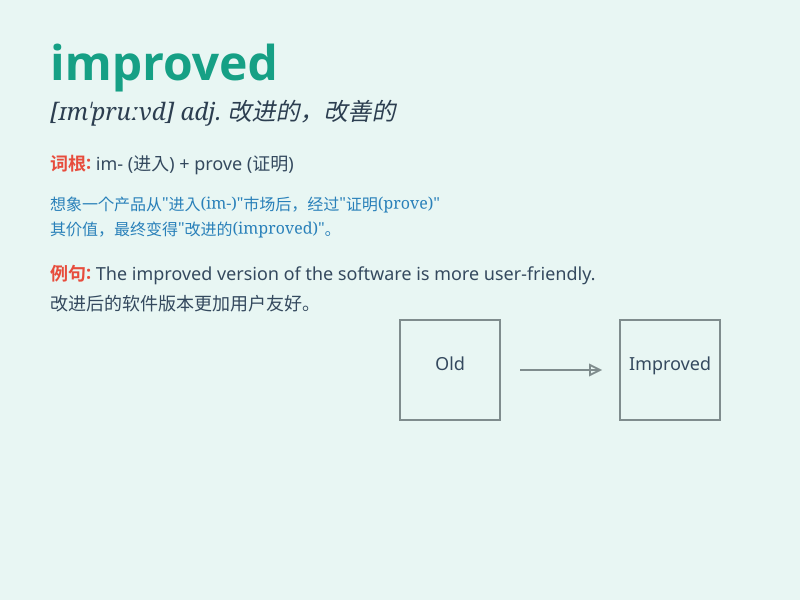

## improved

**英音:** _[ɪmˈpruːvd]_ **美音:** _[ɪmˈpruːvd]_

**译义:** *adj.改良的*

### 短语

+ **improved performance:** _性能提升_

+ **improved version:** _改进版本_

+ **improved method:** _改进的方法_

+ **improved quality:** _质量提高_

+ **improved efficiency:** _效率提高_

### 例句

#### 例句1

> **The company has improved its products to meet customer
demands.**

**中文翻译:** 这家公司已经改进了其产品以满足客户需求。

**单词释义:** 改进；改善

#### 例句2

> **Her health has improved significantly since she started
exercising.**

**中文翻译:** 自从她开始锻炼以来，她的健康状况有了显著的改善。

**单词释义:** 改善；变好

#### 例句3

> **The new teaching method has improved students\' performance.**

**中文翻译:** 新的教学方法提高了学生的成绩。

**单词释义:** 提高；提升

### 背诵小故事

> A poor student always got low grades. But he worked hard and changed
his study methods. Finally, his grades improved. He became a top student
and everyone was happy for him.

**一个成绩差的学生总是得分很低。但他努力学习并改变了学习方法。最终，他的成绩提高了。他成为了优等生，大家都为他高兴。**

### 图义

