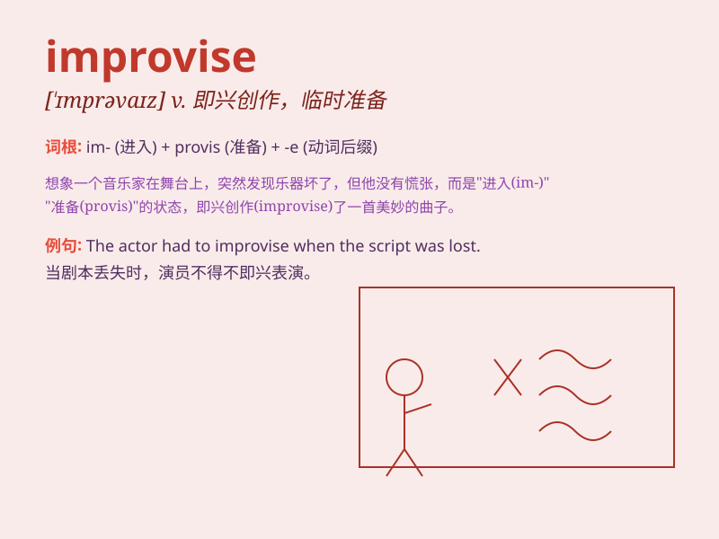

## improvise

**英音:** _[\'ɪmprəvaɪz]_ **美音:** _[\'ɪmprəvaɪz]_

**译义:** *v.临时准备*

### 短语

+ **improvise a speech:** _即兴演讲_

+ **improvise an excuse:** _临时编造借口_

+ **improvise a solution:** _临时想出解决办法_

+ **improvise a melody:** _即兴创作旋律_

+ **improvise a meal:** _临时凑合一顿饭_

### 例句

#### 例句1

> **The actor had to improvise when he forgot his lines.**

**中文翻译:** 这位演员忘词时不得不即兴发挥。

**单词释义:** 即兴创作；临时做

#### 例句2

> **We had no tent, so we had to improvise shelter with blankets.**

**中文翻译:** 我们没有帐篷，所以只好用毯子临时搭个遮蔽处。

**单词释义:** 临时拼凑；临时准备

#### 例句3

> **The musicians were asked to improvise a new piece of music.**

**中文翻译:** 音乐家们被要求即兴创作一首新乐曲。

**单词释义:** 即兴创作

### 背诵小故事

> A musician was suddenly invited to perform but had no prepared sheet
music. So, he had to improvise, creating beautiful melodies on the spot.
It means to create or do something without preparation.

**一位音乐家突然被邀请表演，但没有准备乐谱。于是，他不得不即兴发挥，当场创作出美妙的旋律。这个词意思是无准备地创作或做某事。**

### 图义

