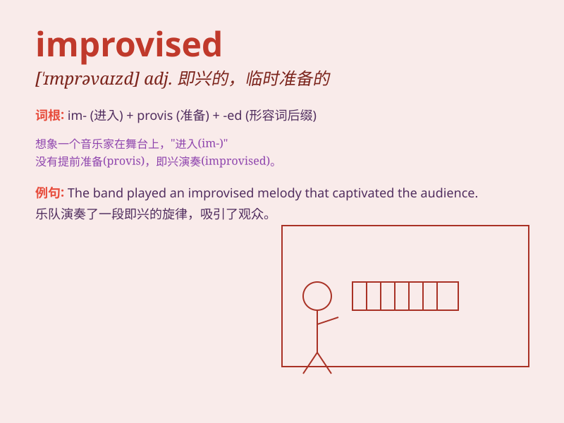

## improvised

**英音:** _[ˈɪmprəvaɪzd]_ **美音:** _[ˈɪmprəvaɪzd]_

**译义:** *adj. 即兴的；临时准备的；即席而作的 v.
即兴创作；临时做；临时提供（improvise 的过去分词）*

### 短语

+ **improvised performance:** _即兴表演_

+ **improvised music:** _即兴音乐_

+ **improvised shelter:** _临时避难所_

+ **improvised solution:** _临时解决方案_

+ **improvised speech:** _即兴演讲_

### 例句

#### 例句1

> **The musician improvised a beautiful melody on the spot.**

**中文翻译:** 这位音乐家当场即兴创作了一段优美的旋律。

**单词释义:** 即兴创作

#### 例句2

> **They had to improvise a shelter when it started to rain.**

**中文翻译:** 开始下雨时，他们不得不临时搭建一个避雨处。

**单词释义:** 临时做；临时搭建

#### 例句3

> **The actors improvised some of the dialogue in the play.**

**中文翻译:** 演员们在剧中即兴说了一些台词。

**单词释义:** 即兴表演；即兴说

### 背诵小故事

> One day, the actors were on stage but suddenly the script was lost.
So, they had to improvise their performance. They made up the lines and
actions as they went along and gave an amazing show.

**有一天，演员们在舞台上但突然剧本丢了。所以，他们不得不即兴表演。他们边演边编台词和动作，并带来了一场精彩的演出。**

### 图义

