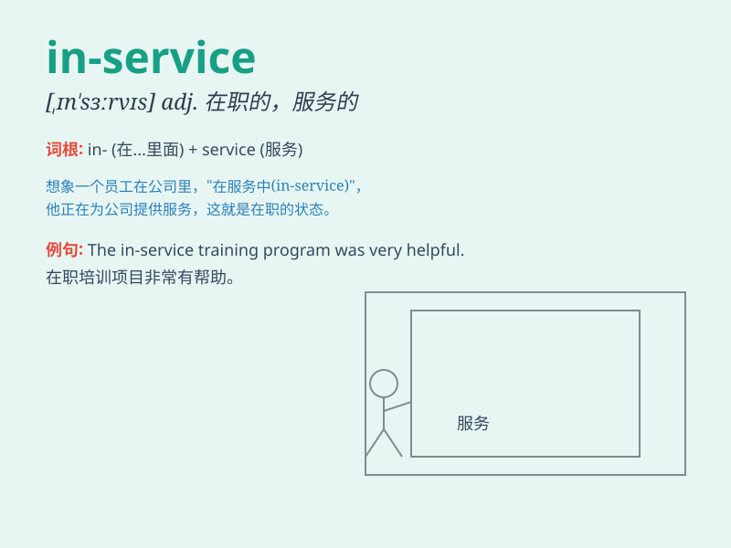

## in-service

**英音:** _[ˈɪn.sɜːvɪs]_ **美音:** _[ˈɪn.sərvɪs]_

**译义:** *adj.在职的；服役中的；现役的；n.在职培训*

### 短语

+ **in-service training:** _在职培训_

+ **in-service inspection:** _在役检查；运行中检验_

+ **in-service date:** _投入使用日期_

+ **in-service staff:** _在职员工_

+ **in-service experience:** _在职经验_

### 例句

#### 例句1

> **The in-service training program is designed to enhance
employees\' skills.**

**中文翻译:** 在职培训计划旨在提高员工的技能。

**单词释义:** 在职的

#### 例句2

> **We have an in-service inspection of the equipment every
month.**

**中文翻译:** 我们每个月都对设备进行一次在役检查。

**单词释义:** 在使用中的；在役的

#### 例句3

> **The in-service teacher shared her valuable experience with the
new ones.**

**中文翻译:** 这位在职教师与新教师分享了她宝贵的经验。

**单词释义:** 在职的

### 背诵小故事

> Imagine a group of workers. They are not training but actively
working and providing services. That\'s what \'in-service\' means. They
are in the middle of serving, doing their jobs.

**想象有一群工人。他们不是在培训，而是在积极工作并提供服务。这就是\'in-service\'的意思。他们正处于服务、工作的过程中。**

### 图义

