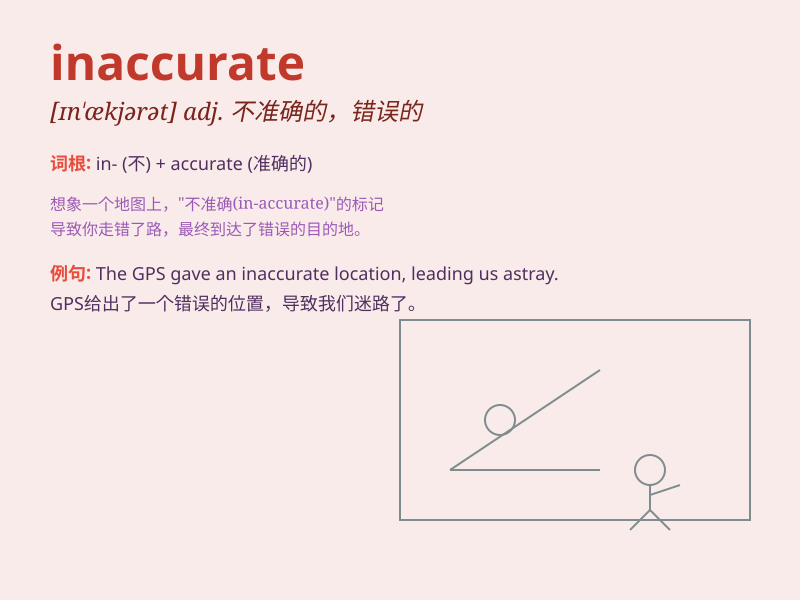

## inaccurate

**英音:** _[ɪn\'ækjʊrət]_ **美音:** _[ɪn\'ækjərət]_

**译义:** *adj.错误的,不准确的*

### 短语

+ **inaccurate measurement:** _不准确的测量_

+ **inaccurate information:** _错误的信息_

+ **inaccurate statement:** _不确切的陈述_

+ **inaccurate prediction:** _不准确的预测_

+ **inaccurate data:** _不准确的数据_

### 例句

#### 例句1

> **The information he provided was inaccurate and misleading.**

**中文翻译:** 他提供的信息不准确且具有误导性。

**单词释义:** 不准确的

#### 例句2

> **The map was inaccurate, causing us to get lost.**

**中文翻译:** 这张地图不准确，导致我们迷路了。

**单词释义:** 不准确的

#### 例句3

> **Her description of the event was inaccurate and full of
errors.**

**中文翻译:** 她对该事件的描述不准确且充满错误。

**单词释义:** 不准确的

### 背诵小故事

> One day, a reporter wrote an article full of mistakes. The
information was inaccurate. His boss was very angry and said, \'You must
be accurate next time!\' So, inaccurate means not correct or exact.

**有一天，一名记者写了一篇满是错误的文章。信息不准确。他的老板非常生气并说：'下次你必须准确！'所以，inaccurate
意思是不正确的、不精确的。**

### 图义

