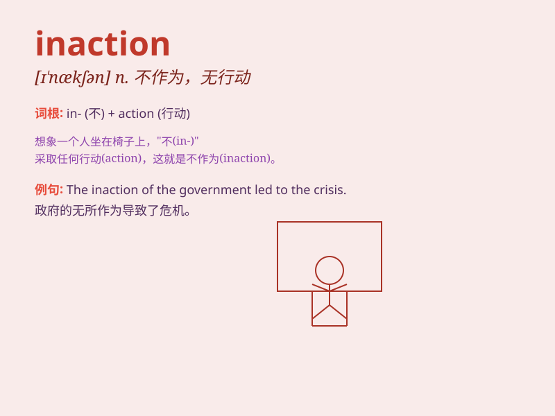

## inaction

**英音:** _[ɪn\'ækʃ(ə)n]_ **美音:** _[ɪn\'ækʃən]_

**译义:** *n.无行动,不活动,无为,怠惰,迟钝*

### 短语

+ **remain inaction:** _保持不作为_

+ **fall into inaction:** _陷入无所作为的状态_

+ **prolonged inaction:** _长期的不作为_

+ **criticize for inaction:** _因不作为而受到批评_

+ **consequences of inaction:** _不作为的后果_

### 例句

#### 例句1

> **The government\'s inaction on environmental issues has drawn
widespread criticism.**

**中文翻译:** 政府在环境问题上的不作为引起了广泛的批评。

**单词释义:** 不作为

#### 例句2

> **His inaction during the emergency cost many lives.**

**中文翻译:** 他在紧急情况下的不作为导致了许多人丧生。

**单词释义:** 不作为；无行动

#### 例句3

> **We cannot afford such inaction in the face of this crisis.**

**中文翻译:** 在这场危机面前，我们承受不起这样的无所作为。

**单词释义:** 无所作为

### 背诵小故事

> A superhero was very angry because the citizens\' inaction allowed
the villain to cause more damage. He shouted, \'Your inaction is making
things worse!\' Meaning they were not taking action to stop the bad
situation.

**一位超级英雄非常生气，因为市民们的不作为让反派造成了更多的破坏。他大喊：'你们的不作为让情况变得更糟！'意思是他们没有采取行动来阻止糟糕的局面。**

### 图义

