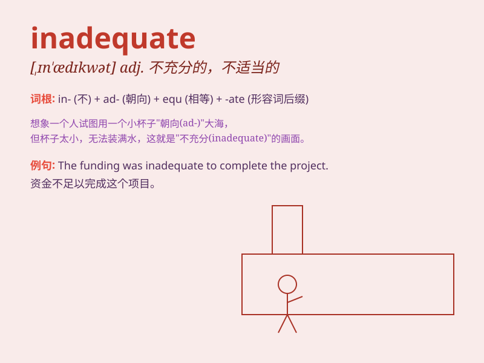

## inadequate

**英音:** _[ɪn\'ædɪkwət]_ **美音:** _[ɪn\'ædɪkwət]_

**译义:** *adj.不充分的,不适当的*

### 短语

+ **inadequate supply:** _供应不足_

+ **inadequate resources:** _资源不足_

+ **inadequate preparation:** _准备不充分_

+ **inadequate protection:** _保护不力_

+ **inadequate knowledge:** _知识不足_

### 例句

#### 例句1

> **The supply of food was inadequate for the number of refugees.**

**中文翻译:** 食物的供应对于难民的数量来说是不足的。

**单词释义:** 不足的；不够的

#### 例句2

> **His performance was inadequate and he failed to meet the
expectations.**

**中文翻译:** 他的表现不充分，未能达到预期。

**单词释义:** 不充分的；不能胜任的

#### 例句3

> **The safety measures were inadequate to prevent the accident.**

**中文翻译:** 安全措施不足以预防事故。

**单词释义:** 不足够的；不适当的

### 背诵小故事

>
想象一个厨师准备了一桌饭菜，但食材不足（inadequate）。客人都饿着肚子，因为饭菜的量完全不够。这就像
in 表示否定，adequate 是足够的，合起来就是不足够的。

**想象厨师准备的饭菜食材不足，解释 in 表否定，adequate
表足够，合起来就是不足够的**

### 图义

