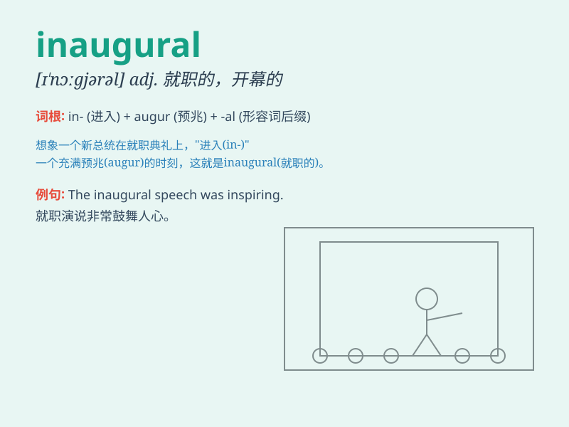

## inaugural

**英音:** _[ɪ\'nɔːgjʊr(ə)l]_ **美音:** _[ɪ\'nɔɡjərəl]_

**译义:** *adj.就职的,开始的n.就职演说*

### 短语

+ **inaugural address:** _就职演说_

+ **inaugural ceremony:** _就职典礼_

+ **inaugural speech:** _就职演讲_

+ **inaugural meeting:** _成立大会；开幕会议_

+ **inaugural session:** _开幕会议；首届会议_

### 例句

#### 例句1

> **The president delivered an inaugural speech.**

**中文翻译:** 总统发表就职演说。

**单词释义:** 就职的；开幕的

#### 例句2

> **The inaugural meeting of the club was well attended.**

**中文翻译:** 俱乐部成立大会出席人数众多。

**单词释义:** 开始的；首次的

#### 例句3

> **This was the inaugural flight of the new airline.**

**中文翻译:** 这是新航空公司的首航。

**单词释义:** 首次的；初创的

### 背诵小故事

> The president\'s inaugural speech was highly anticipated. A young
journalist named Lily was assigned to cover it. She was nervous but
excited, knowing this was a crucial moment. \'Inaugural\' means marking
the beginning of an important event.

**总统的就职演说备受期待。一位名叫莉莉的年轻记者被派去报道。她既紧张又兴奋，知道这是一个关键的时刻。\'inaugural\'意思是标志着一个重要事件的开始。**

### 图义

