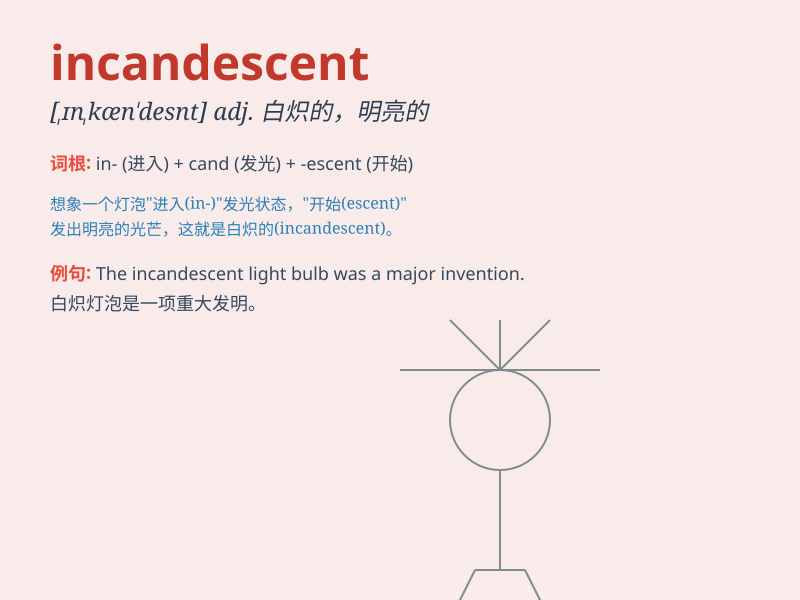

## incandescent

**英音:** _[ɪnkæn\'des(ə)nt]_ **美音:**
_[\'ɪnkən\'dɛsnt]_

**译义:** *adj.遇热发光的,白炽的*

### 短语

+ **incandescent light:** _白炽灯_

+ **incandescent bulb:** _白炽灯泡_

+ **incandescent anger:** _怒火中烧_

+ **incandescent enthusiasm:** _炽热的热情_

+ **incandescent heat:** _白热；白炽热_

### 例句

#### 例句1

> **The incandescent light bulb illuminated the room.**

**中文翻译:** 白炽灯泡照亮了房间。

**单词释义:** 白炽的

#### 例句2

> **She had an incandescent smile that could light up anyone\'s
day.**

**中文翻译:** 她有着灿烂的笑容，可以照亮任何人的一天。

**单词释义:** 灿烂的；热情洋溢的

#### 例句3

> **The incandescent anger in his eyes was terrifying.**

**中文翻译:** 他眼中的怒火，令人毛骨悚然。

**单词释义:** 炽热的

### 背诵小故事

> A scientist was working in the lab. Suddenly, a light bulb shone with
an incandescent glow, so bright and hot. It was like a magical fire,
making the room full of warmth and light. The scientist was amazed by
this incandescent phenomenon.

**一位科学家正在实验室工作。突然，一个灯泡发出白炽的光芒，如此明亮和炽热。就像神奇的火焰，让房间充满温暖和光亮。科学家对这种白炽现象感到惊讶。**

### 图义

