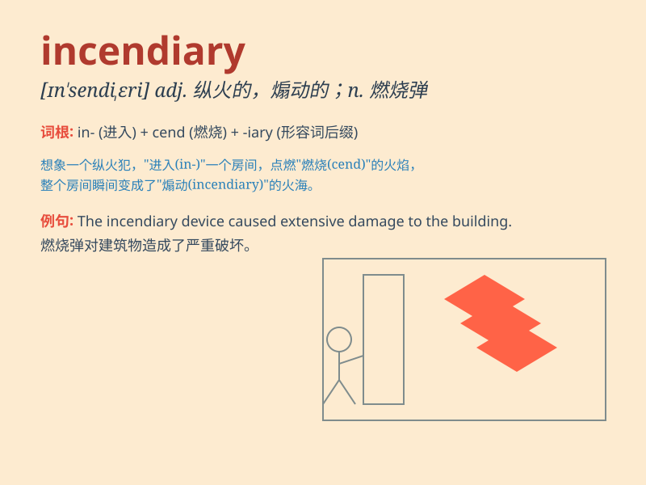

## incendiary

**英音:** _[ɪn\'sendɪərɪ]_ **美音:** _[ɪn\'sɛndɪɛri]_

**译义:** *adj.纵火的,煽动的n.纵火犯,煽动者,燃烧弹*

### 短语

+ **incendiary bomb:** _燃烧弹_

+ **incendiary device:** _纵火装置_

+ **incendiary speech:** _煽动性演说_

+ **incendiary material:** _易燃材料_

+ **incendiary attack:** _纵火袭击_

### 例句

#### 例句1

> **The incendiary remarks sparked a public outcry.**

**中文翻译:** 煽动性言论引发公众强烈抗议。

**单词释义:** 煽动性的

#### 例句2

> **The police found incendiary devices in the suspect\'s car.**

**中文翻译:** 警方在嫌疑人的车内发现了燃烧装置。

**单词释义:** 燃烧的

#### 例句3

> **He was accused of making incendiary speeches to stir up
trouble.**

**中文翻译:** 他被指控发表煽动性言论煽动骚乱。

**单词释义:** 煽动性的

### 背诵小故事

> A criminal threw an incendiary device into a building, causing a huge
fire. The police quickly arrived to catch him. Remember, \'incendiary\'
means something that causes fire or is intended to start a fire.

**一个罪犯向一座大楼投掷了一个燃烧弹，引发了一场大火。警察迅速赶到抓住了他。记住，\'incendiary\'意思是能引起火灾的或意图纵火的东西。**

### 图义

