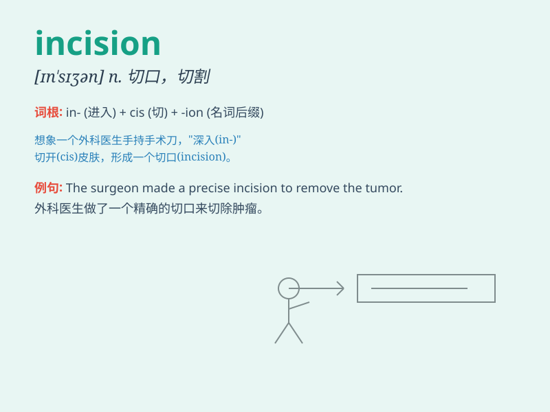

## incision

**英音:** _[ɪn\'sɪʒ(ə)n]_ **美音:** _[ɪn\'sɪʒən]_

**译义:** *n.切割,切开,切口*

### 短语

+ **make an incision:** _做一个切口_

+ **surgical incision:** _外科切口_

+ **deep incision:** _深切口_

+ **small incision:** _小切口_

+ **incision site:** _切口部位_

### 例句

#### 例句1

> **The surgeon made a precise incision on the patient\'s
abdomen.**

**中文翻译:** 外科医生在病人的腹部做了一个精确的切口。

**单词释义:** 切口；切开

#### 例句2

> **There was a small incision in the leather jacket.**

**中文翻译:** 皮夹克上有一个小切口。

**单词释义:** 切口；割口

#### 例句3

> **The incision of the fruit revealed its juicy interior.**

**中文翻译:** 水果的切口显露了其多汁的内部。

**单词释义:** 切开；割开

### 背诵小故事

> A doctor made an incision on the patient\'s arm. The sharp knife cut
through the skin carefully. This incision was needed to fix the problem
inside.

**一位医生在病人的手臂上做了一个切口。锋利的刀小心地割破皮肤。这个切口是为了修复里面的问题。**

### 图义

