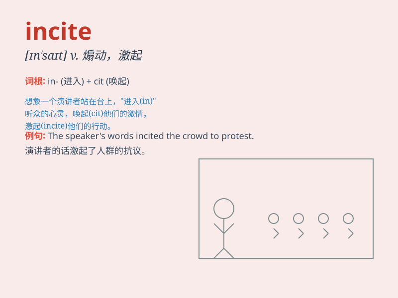

## incite

**英音:** _[ɪn\'saɪt]_ **美音:** _[ɪn\'saɪt]_

**译义:** *vt.激动,煽动*

### 短语

+ **incite violence:** _煽动暴力_

+ **incite rebellion:** _煽动叛乱_

+ **incite hatred:** _激起仇恨_

+ **incite conflict:** _挑起冲突_

+ **incite disorder:** _煽动骚乱_

### 例句

#### 例句1

> **The leader\'s speech incited the crowd to take action.**

**中文翻译:** 领导人的讲话煽动群众采取行动。

**单词释义:** 煽动；鼓动

#### 例句2

> **He was accused of inciting violence during the protest.**

**中文翻译:** 他被指控在抗议期间煽动暴力。

**单词释义:** 煽动；挑起

#### 例句3

> **Her words incited him to greater efforts.**

**中文翻译:** 她的话激励他更加努力。

**单词释义:** 激励；刺激

### 背诵小故事

> In a quiet town, a bad guy was constantly trying to incite the
residents to rebel against the local rules. His words were like sparks,
but the wise mayor managed to stop his evil plan.

**在一个安静的小镇上，一个坏人不断试图煽动居民反抗当地的规定。他的话就像火花，但英明的镇长设法阻止了他的邪恶计划。**

### 图义

