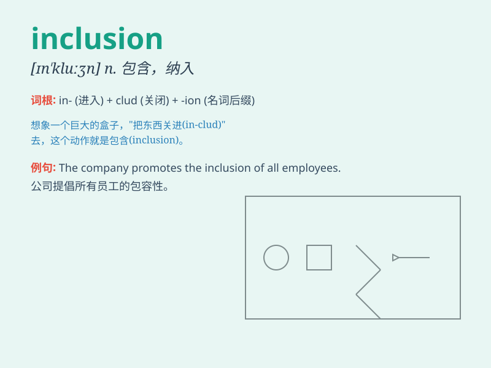

## inclusion

**英音:** _[ɪn\'kluːʒ(ə)n]_ **美音:** _[ɪn\'kluʒn]_

**译义:** *n.包含,内含物*

### 短语

+ **inclusion criteria:** _纳入标准；入选标准_

+ **inclusion body:** _包涵体；内含体_

+ **social inclusion:** _社会包容；社会融入_

+ **inclusion compound:** _包合物；包接化合物_

+ **inclusion policy:** _包容政策_

### 例句

#### 例句1

> **The inclusion of new members into the club was carefully
considered.**

**中文翻译:** 新会员加入俱乐部是经过仔细考虑的。

**单词释义:** 加入；包含

#### 例句2

> **The report emphasizes the importance of inclusion in
education.**

**中文翻译:** 报告强调了包容性教育的重要性。

**单词释义:** 包容；包括

#### 例句3

> **The company\'s success is due to the inclusion of diverse
perspectives.**

**中文翻译:** 该公司的成功归功于包容不同的观点。

**单词释义:** 包含；包括

### 背诵小故事

> Once upon a time, a king held a grand party. Everyone was invited,
showing the king\'s belief in inclusion. He wanted to make sure no one
was left out and all could enjoy the celebration together.

**从前，有个国王举办了一场盛大的聚会。每个人都受到了邀请，展现了国王对包容的信念。他想确保无人被遗漏，所有人都能一起享受这场庆典。**

### 图义

