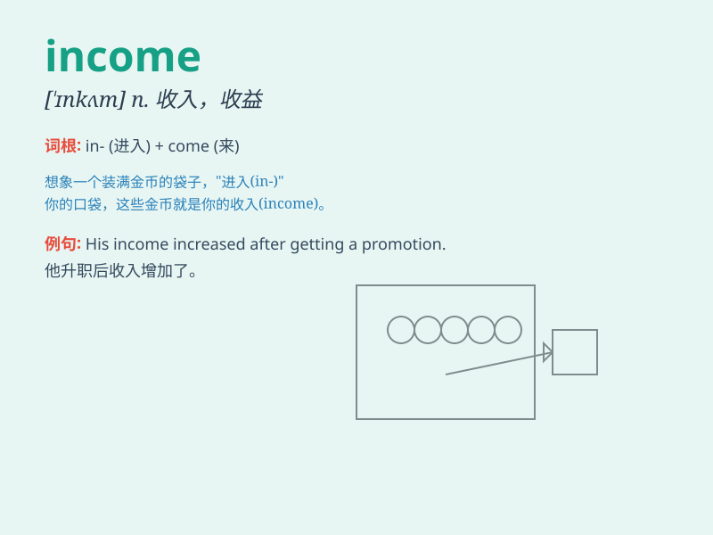

## income

**英音:** _[\'ɪnkʌm]_ **美音:** _[\'ɪnkʌm]_

**译义:** *n.收入,收益,进款,所得*

### 短语

+ **income tax:** _所得税_

+ **personal income:** _个人收入_

+ **family income:** _家庭收入_

+ **low income:** _低收入_

+ **high income:** _高收入_

### 例句

#### 例句1

> **His income has increased significantly this year.**

**中文翻译:** 今年他的收入大幅增加。

**单词释义:** 收入

#### 例句2

> **She relies on her part-time job income to support her
studies.**

**中文翻译:** 她依靠兼职收入来支持她的学业。

**单词释义:** 收入

#### 例句3

> **The family\'s main income comes from the father\'s business.**

**中文翻译:** 家里的主要收入来自父亲的生意。

**单词释义:** 收入

### 背诵小故事

> A poor man was always looking for ways to increase his income. One
day, he found a part-time job and finally saw more money coming in. With
this new income, he could improve his life.

**一个穷人总是在寻找增加收入的方法。有一天，他找到了一份兼职工作，终于看到更多的钱进来了。凭借这笔新的收入，他能够改善自己的生活。**

### 图义

