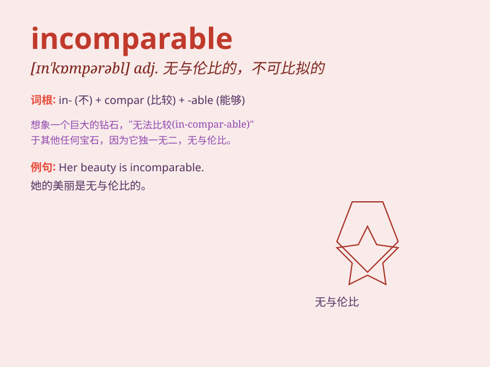

## incomparable

**英音:** _[ɪn\'kɒmp(ə)rəb(ə)l]_ **美音:**
_[ɪn\'kɑmprəbl]_

**译义:** *adj.无与伦比的,不能比较的*

### 短语

+ **incomparable beauty:** _无与伦比的美丽_

+ **incomparable advantage:** _无可比拟的优势_

+ **incomparable wisdom:** _无可匹敌的智慧_

+ **incomparable performance:** _无可媲美的表现_

+ **incomparable skill:** _无可匹敌的技能_

### 例句

#### 例句1

> **The beauty of the Taj Mahal is incomparable.**

**中文翻译:** 泰姬陵的美丽是无与伦比的。

**单词释义:** 无比的；无双的；不可比拟的

#### 例句2

> **His talent for music is incomparable to that of his peers.**

**中文翻译:** 他的音乐天赋是同龄人无法比拟的。

**单词释义:** 无可匹敌的；不能比较的

#### 例句3

> **The experience of climbing Mount Everest is incomparable.**

**中文翻译:** 攀登珠穆朗玛峰的体验是无与伦比的。

**单词释义:** 无可比拟的；不能相比的

### 背诵小故事

> Once upon a time, there was a magical gem. Its beauty was
incomparable. No other gem could match its shine and charm. This gem
made everyone realize that \'incomparable\' means having no equal or
match.

**从前，有一颗神奇的宝石。它的美丽无与伦比。没有其他宝石能比得上它的光芒和魅力。这个故事让大家明白'incomparable'意思是无可比拟的、无双的。**

### 图义

