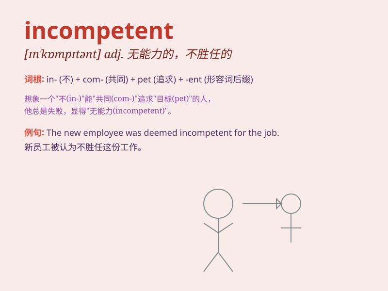

## incompetent

**英音:** _[ɪn\'kɒmpɪt(ə)nt]_ **美音:**
_[ɪn\'kɑmpɪtənt]_

**译义:** *adj.不合格的,不胜任的n.无能力者*

### 短语

+ **incompetent person:** _不称职的人_

+ **incompetent management:** _无能的管理_

+ **incompetent performance:** _不合格的表现_

+ **incompetent judge:** _不称职的法官_

+ **incompetent staff:** _不称职的员工_

### 例句

#### 例句1

> **The incompetent doctor made a serious mistake in the
diagnosis.**

**中文翻译:** 这位无能的医生在诊断上犯了严重错误。

**单词释义:** 不称职的

#### 例句2

> **The company fired several incompetent employees to improve
efficiency.**

**中文翻译:** 该公司解雇了几名不称职的员工以提高效率。

**单词释义:** 不称职的；无能力的

#### 例句3

> **He is completely incompetent when it comes to managing
finances.**

**中文翻译:** 在管理财​​务方面，他完全无能。

**单词释义:** 无能的

### 背诵小故事

> A king had a minister who always made wrong decisions and failed to
handle affairs properly. The king called him incompetent. Eventually,
the kingdom suffered because of this minister\'s inability to do the job
well.

**一位国王有个大臣，总是做错误的决定，也不能妥善处理事务。国王称他无能。最终，这个王国因为这位大臣无法胜任工作而遭殃。**

### 图义

