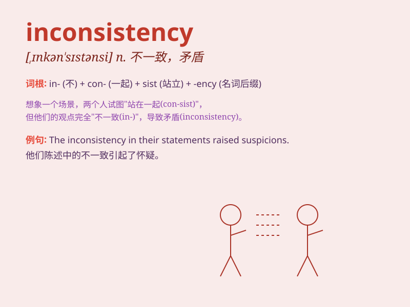

## inconsistency

**英音:** _[ɪnkən\'sɪst(ə)nsɪ]_ **美音:**
_[,ɪnkən\'sɪstənsi]_

**译义:** *n.矛盾*

### 短语

+ **inconsistency in:** _在\...\...方面的不一致_

+ **logical inconsistency:** _逻辑上的不一致_

+ **inconsistency between:** _在\...\...之间的不一致_

+ **minor inconsistency:** _轻微的不一致_

+ **major inconsistency:** _重大的不一致_

### 例句

#### 例句1

> **The report pointed out several inconsistencies in the data.**

**中文翻译:** 报告指出了数据中的一些不一致之处。

**单词释义:** 不一致；不协调

#### 例句2

> **There is an inconsistency between his words and actions.**

**中文翻译:** 他的言行不一致。

**单词释义:** 不一致；矛盾

#### 例句3

> **The inconsistencies in her story made us suspicious.**

**中文翻译:** 她的故事中的前后矛盾让我们产生了怀疑。

**单词释义:** 不一致；不相符

### 背诵小故事

> Once there was a judge who often made inconsistent decisions. One
day, a smart lawyer pointed out this inconsistency. The judge realized
his mistake and promised to be more consistent.

**曾经有一位法官经常做出不一致的裁决。有一天，一位聪明的律师指出了这种不一致性。法官意识到了自己的错误，并承诺会更加一致。**

### 图义

