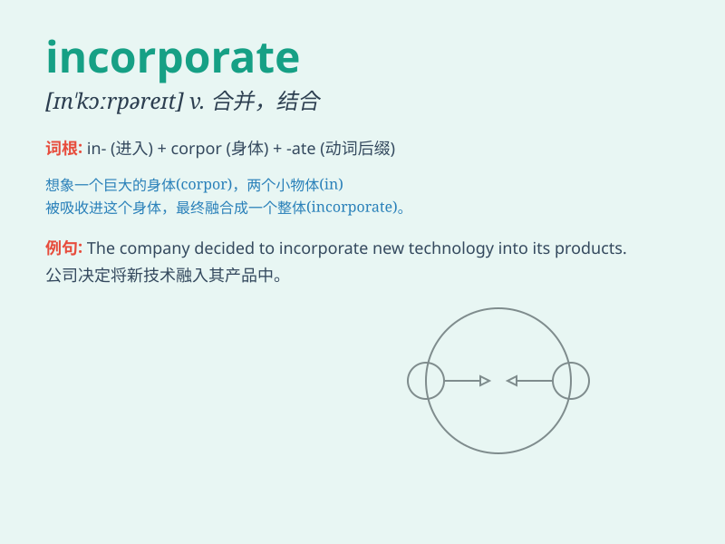

## incorporate

**英音:** _[ɪnˈkɔːpəreɪt]_ **美音:** _[ɪnˈkɔːrpəreɪt]_

**译义:**
*adj.合并的,结社的,一体化的vt.合并,使组成公司,具体表现vi.合并,混合,组成公司vt.[律]结社,使成为法人组织*

### 短语

+ **incorporate into:** _并入；使成为...的一部分_

+ **incorporate with:** _与...合并_

+ **be incorporated in:** _被包含在...中_

+ **incorporate sth. into sth.:** _把某物纳入某物_

+ **incorporate oneself:** _使自己融入_

### 例句

#### 例句1

> **The company decided to incorporate new technology into its
production process.**

**中文翻译:** 该公司决定将新技术融入其生产过程。

**单词释义:** 纳入；包含

#### 例句2

> **We should incorporate exercise into our daily routine to stay
healthy.**

**中文翻译:** 我们应该将锻炼纳入日常生活中以保持健康。

**单词释义:** 使并入；包含

#### 例句3

> **The new law incorporates several previous regulations.**

**中文翻译:** 新法律纳入了之前的几项规定。

**单词释义:** 包含；合并

### 背诵小故事

> A small company wanted to grow. So, it decided to incorporate the
ideas and talents of a successful team. By doing this, it became
stronger and more successful. Incorporate means to take in and include
as part of a whole.

**一家小公司想要发展。于是，它决定将一个成功团队的想法和人才纳入进来。通过这样做，它变得更强大和更成功。incorporate
意思是包含，合并，纳入**

### 图义

