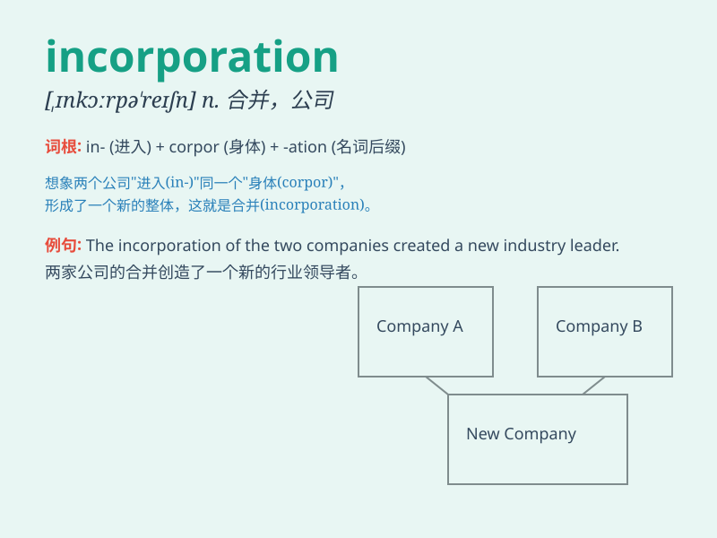

## incorporation

**英音:** _[ɪn,kɔːpə\'reɪʃən]_ **美音:**
_[ɪn,kɔrpə\'reʃən]_

**译义:** *n.结合,合并,形成法人组织,组成公司(或社团)*

### 短语

+ **incorporation certificate:** _公司注册证书_

+ **incorporation process:** _公司组建过程_

+ **incorporation law:** _公司法_

+ **incorporation date:** _成立日期_

+ **incorporation form:** _注册表格_

### 例句

#### 例句1

> **The incorporation of new technology has greatly improved our
production efficiency.**

**中文翻译:** 新技术的融入极大地提高了我们的生产效率。

**单词释义:** 引入；合并

#### 例句2

> **The company completed the incorporation process last month.**

**中文翻译:** 该公司上个月完成了注册程序。

**单词释义:** 合并；组成公司

#### 例句3

> **The incorporation of local customs into the design made the
product more appealing.**

**中文翻译:** 将当地习俗融入设计中，使产品更具吸引力。

**单词释义:** 融入；包含

### 背诵小故事

> A small company was struggling to grow. But with smart decisions and
hard work, it incorporated new ideas and technologies. Finally, it
became a big and successful corporation.

**一家小公司发展艰难。但通过明智的决策和努力工作，它融入了新的想法和技术。最终，它成为了一家大型且成功的公司。**

### 图义

