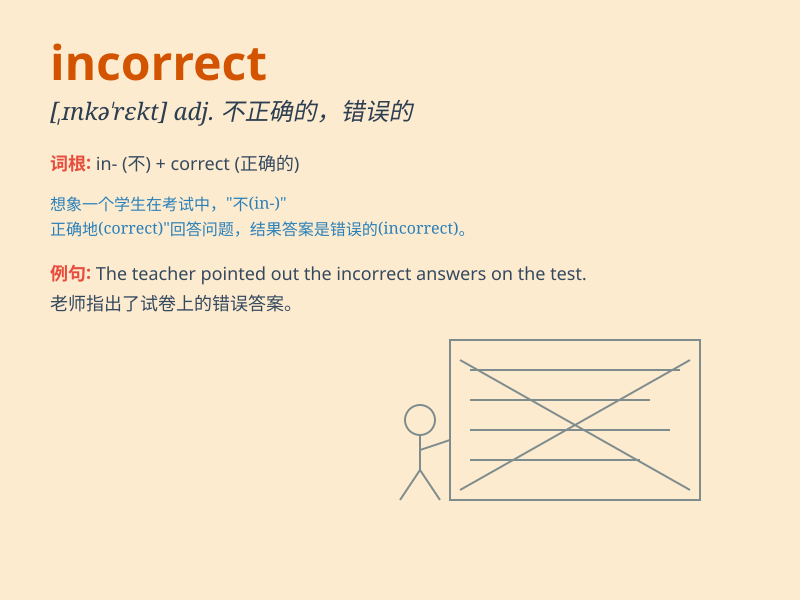

## incorrect

**英音:** _[ɪnkə\'rekt]_ **美音:** _[,ɪnkə\'rɛkt]_

**译义:** *adj.错误的,不正确的*

### 短语

+ **incorrect answer:** _错误答案_

+ **incorrect information:** _错误信息_

+ **incorrect pronunciation:** _错误发音_

+ **incorrect spelling:** _错误拼写_

+ **incorrect behavior:** _不正确的行为_

### 例句

#### 例句1

> **The answer you gave is incorrect.**

**中文翻译:** 你给出的答案是不正确的。

**单词释义:** 不正确的

#### 例句2

> **His pronunciation of this word is incorrect.**

**中文翻译:** 他这个单词的发音不正确。

**单词释义:** 不正确的

#### 例句3

> **The information you received was incorrect.**

**中文翻译:** 你收到的信息是不正确的。

**单词释义:** 不正确的

### 背诵小故事

> One day, Tom answered a math question. He was very confident but his
answer was incorrect. The teacher pointed out his mistake and Tom
realized he should be more careful.

**一天，汤姆回答了一道数学题。他非常自信，但他的答案是不正确的。老师指出了他的错误，汤姆意识到他应该更仔细些。**

### 图义

