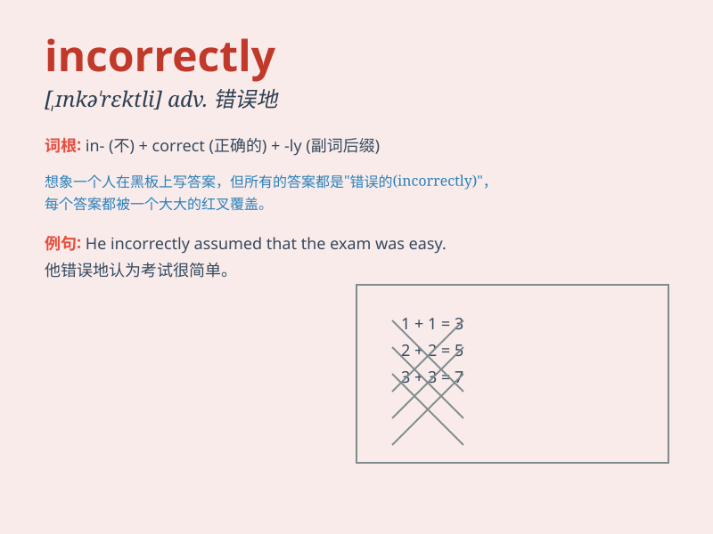

## incorrectly

**英音:** _[ˌɪnkə\'rektlɪ]_ **美音:** _[,ɪnkə\'rɛktli]_

**译义:** *adv.不正确地,错误地*

### 短语

+ **answer incorrectly:** _回答错误_

+ **judge incorrectly:** _判断错误_

+ **calculate incorrectly:** _计算错误_

+ **perceive incorrectly:** _理解错误_

+ **interpret incorrectly:** _解释错误_

### 例句

#### 例句1

> **He answered the question incorrectly.**

**中文翻译:** 他回答这个问题不正确。

**单词释义:** 不正确地

#### 例句2

> **The address was written incorrectly on the envelope.**

**中文翻译:** 地址在信封上写错了。

**单词释义:** 错误地

#### 例句3

> **She pronounced the word incorrectly.**

**中文翻译:** 她这个单词发音不正确。

**单词释义:** 不正确地

### 背诵小故事

> One day, Tom answered a math question incorrectly. His teacher
pointed it out and explained that he should be more careful. Tom
realized his mistake and promised to do better next time.

**一天，汤姆答错了一道数学题。他的老师指出来并解释说他应该更仔细些。汤姆意识到了自己的错误，并承诺下次会做得更好。**

### 图义

