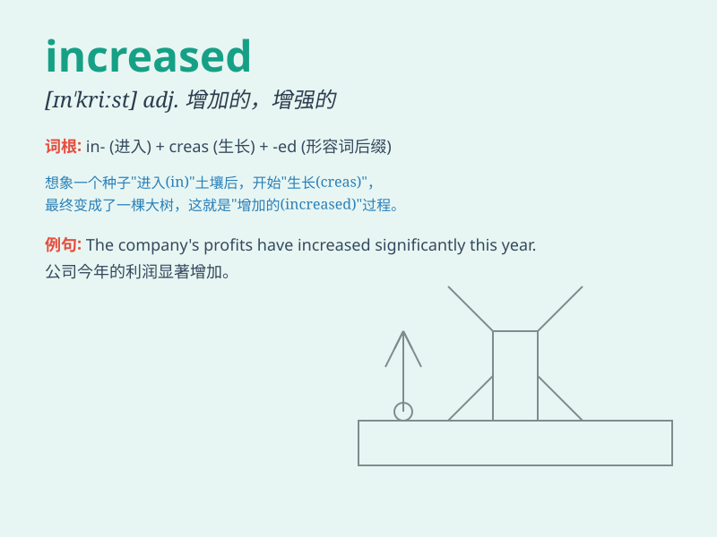

## increased

**英音:** _[ɪnˈkriːst]_ **美音:** _[ɪnˈkriːst]_

**译义:** *adj.增加的,增强的*

### 短语

+ **increased demand:** _增长的需求_

+ **increased risk:** _增加的风险_

+ **increased pressure:** _增加的压力_

+ **increased efficiency:** _提高的效率_

+ **increased productivity:** _提高的生产力_

### 例句

#### 例句1

> **The company has seen increased profits this year.**

**中文翻译:** 这家公司今年利润有所增长。

**单词释义:** 增长的

#### 例句2

> **There has been an increased demand for organic food.**

**中文翻译:** 对有机食品的需求有所增加。

**单词释义:** 增加的

#### 例句3

> **Increased rainfall has caused flooding in some areas.**

**中文翻译:** 降雨量的增加导致了一些地区的洪水泛滥。

**单词释义:** 增加了的

### 背诵小故事

> A small plant grew in a hidden corner. With time and care, it
received more sunlight and water. Day by day, it increased in size and
became a beautiful big flower.

**一株小植物生长在一个隐蔽的角落。随着时间推移和悉心照料，它获得了更多的阳光和水分。日复一日，它的体积增大了，变成了一朵美丽的大花。**

### 图义

