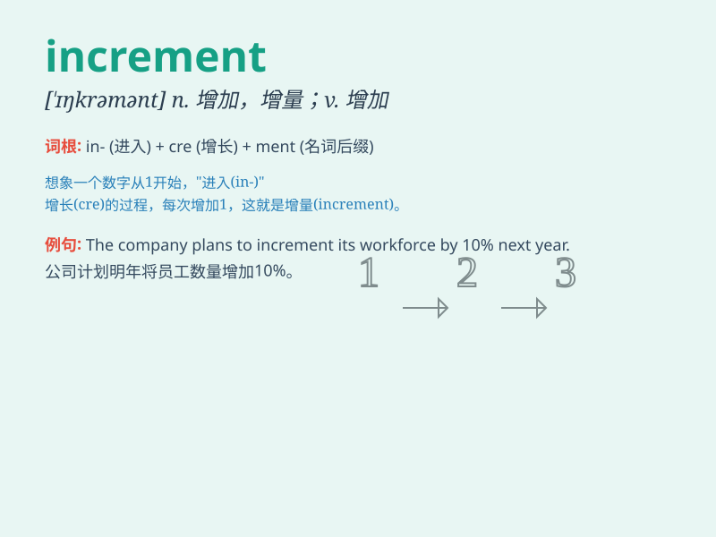

## increment

**英音:** _[\'ɪŋkrɪm(ə)nt]_ **美音:** _[\'ɪŋkrəmənt]_

**译义:** *n.增加,增量*

### 短语

+ **increment value:** _增量值_

+ **annual increment:** _年度增量；年增薪_

+ **increment factor:** _增量因子_

+ **salary increment:** _加薪_

+ **small increment:** _小增量_

### 例句

#### 例句1

> **The increment in salary was much appreciated by the
employees.**

**中文翻译:** 工资的增加深受员工们的赞赏。

**单词释义:** 增加；增量

#### 例句2

> **The software measures the increment of data transfer speed over
time.**

**中文翻译:** 该软件测量数据传输速度随时间的增量。

**单词释义:** 增量；增加量

#### 例句3

> **Each month saw a small increment in the number of visitors to the
website.**

**中文翻译:** 每个月网站的访问者数量都有小幅增加。

**单词释义:** 增加；增长

### 背诵小故事

> A young scientist was conducting experiments to measure the increment
in plant growth. Every day, she carefully noted the small changes, and
finally, she discovered a key factor that led to significant increment.

**一位年轻的科学家正在进行实验以测量植物生长的增量。每天，她都仔细记录下微小的变化，最终，她发现了导致显著增量的关键因素。**

### 图义

