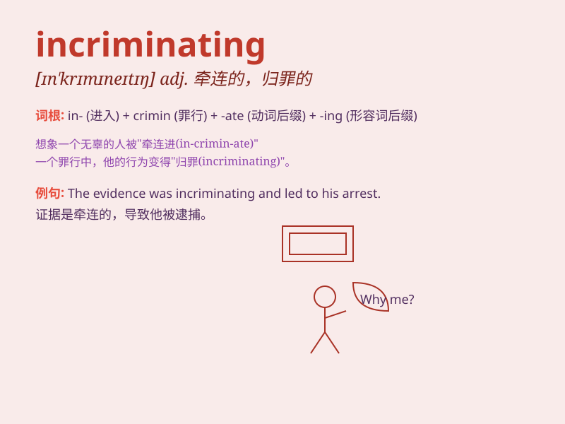

## incriminating

**英音:** _[ɪnˈkrɪmɪneɪtɪŋ]_ **美音:**
_[ɪnˈkrɪmɪneɪtɪŋ]_

**译义:** *adj. 显示有罪的；负罪的；使负罪的；指控犯罪的*

### 短语

+ **incriminating evidence:** _定罪证据；有罪证据_

+ **incriminating statement:** _归罪陈述；有罪供述_

+ **incriminating circumstances:** _有罪情状；犯罪情况_

+ **incriminating oneself:** _自我归罪；自证其罪_

+ **incriminating material:** _有罪材料；犯罪相关材料_

### 例句

#### 例句1

> **The evidence presented was highly incriminating.**

**中文翻译:** 所出示的证据极具指控性。

**单词释义:** 指控的；显示有罪的

#### 例句2

> **His statement contained incriminating details.**

**中文翻译:** 他的陈述包含了有罪的细节。

**单词释义:** 显示有罪的；归罪的

#### 例句3

> **The photographs were incriminating evidence against him.**

**中文翻译:** 这些照片是对他不利的有罪证据。

**单词释义:** 使负罪的；牵连入罪的

### 背诵小故事

> A detective was investigating a crime. He found some incriminating
evidence like a bloody knife and a torn letter. These items pointed to
the suspect and made it clear that he was involved in the crime.

**一位侦探在调查一起犯罪案件。他发现了一些定罪的证据，比如带血的刀和撕破的信件。这些物品指向了嫌疑人，清楚地表明他参与了犯罪。**

### 图义

