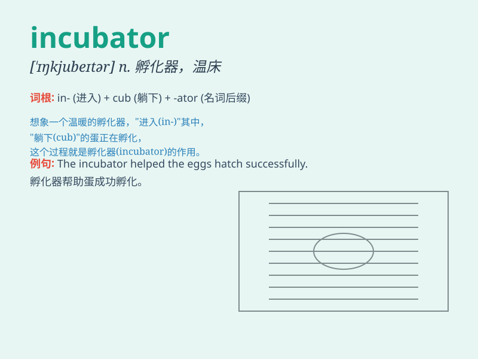

## incubator

**英音:** _[\'ɪŋkjʊbeɪtə]_ **美音:** _[\'ɪŋkjubetɚ]_

**译义:** *n.培养的器具,孵卵器,早产儿保育器*

### 短语

+ **business incubator:** _企业孵化器_

+ **incubator room:** _孵化室_

+ **incubator program:** _孵化计划_

+ **incubator facility:** _孵化设施_

+ **incubator project:** _孵化项目_

### 例句

#### 例句1

> **The business incubator provides support and resources for
startups.**

**中文翻译:** 这个商业孵化器为初创企业提供支持和资源。

**单词释义:** 孵化器

#### 例句2

> **The hospital has a modern incubator for premature babies.**

**中文翻译:** 这家医院有一个现代化的早产儿保育箱。

**单词释义:** 保育箱

#### 例句3

> **The scientist used the incubator to grow the bacteria
samples.**

**中文翻译:** 这位科学家使用培养箱来培养细菌样本。

**单词释义:** 培养箱

### 背诵小故事

>
想象一只受伤的小鸟被放进一个特殊的盒子里，这个盒子能提供温暖和保护，帮助小鸟恢复健康。这个盒子就像一个'incubator'（孵化器），为生命的成长创造适宜的环境。

**想象一只受伤的小鸟被放进一个像孵化器的盒子里，它能提供温暖和保护，助小鸟恢复，以此来记'incubator'这个表示孵化器的单词。**

### 图义

