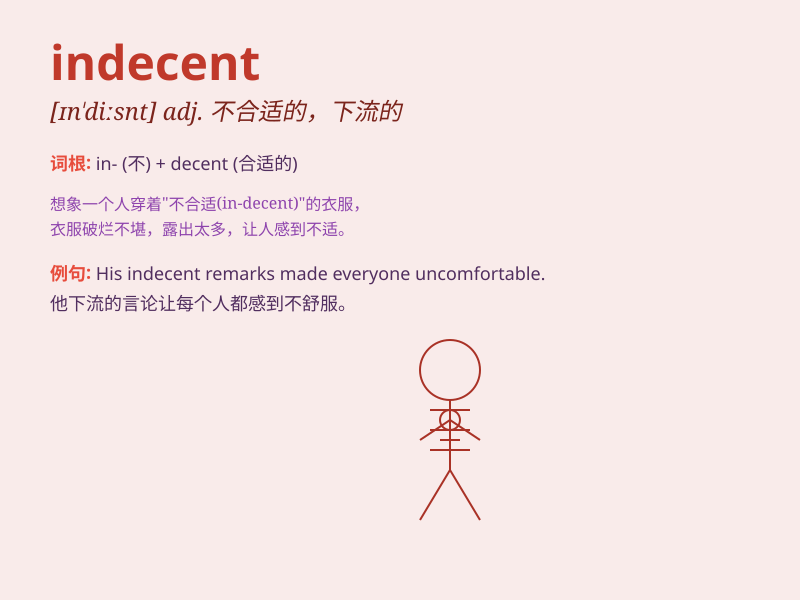

## indecent

**英音:** _[ɪn\'diːs(ə)nt]_ **美音:** _[ɪn\'disnt]_

**译义:** *adj.下流的,猥亵的,\<口>不象样的,不妥当的*

### 短语

+ **indecent behavior:** _不雅行为_

+ **indecent exposure:** _不雅暴露_

+ **indecent language:** _粗言秽语_

+ **indecent haste:** _仓促行事_

+ **indecent proposal:** _不适当的提议_

### 例句

#### 例句1

> **His indecent behavior at the party shocked everyone.**

**中文翻译:** 他在聚会上的不雅行为震惊了所有人。

**单词释义:** 不雅的；粗鄙的

#### 例句2

> **The actress was criticized for her indecent dress on the red
carpet.**

**中文翻译:** 这位女演员因在红毯上穿着不得体而受到批评。

**单词释义:** 不得体的；不适当的

#### 例句3

> **The indecent language he used was unacceptable in public.**

**中文翻译:** 他使用的粗秽语言在公共场合是不可接受的。

**单词释义:** 粗秽的；下流的

### 背诵小故事

> One day, Tom saw a man wearing indecent clothes in the street. The
clothes were too revealing and not proper. This made Tom feel
uncomfortable and he realized the importance of dressing appropriately.

**一天，汤姆在街上看到一个男人穿着不得体的衣服。衣服太暴露且不合适。这让汤姆感到不舒服，他意识到穿着得体的重要性。**

### 图义

