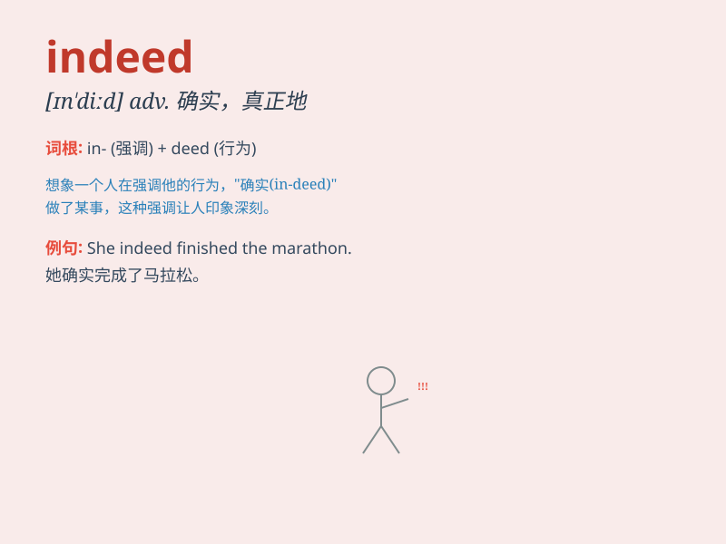

## indeed

**英音:** _[ɪnˈdiːd]_ **美音:** _[ɪnˈdid]_

**译义:** *adv.确实，真正地；当然；事实上*

### 短语

+ **indeed so:** _确实如此_

+ **thank you indeed:** _真的谢谢你_

+ **indeed very much:** _确实非常_

+ **indeed fortunate:** _确实幸运_

+ **indeed interesting:** _确实有趣_

### 例句

#### 例句1

> **It is indeed a beautiful day.**

**中文翻译:** 这确实是美好的一天。

**单词释义:** 确实；的确

#### 例句2

> **I was indeed very glad to hear the news.**

**中文翻译:** 听到这个消息我确实很高兴。

**单词释义:** 确实；的确

#### 例句3

> **He is a great man indeed.**

**中文翻译:** 他确实是一个伟人。

**单词释义:** 确实；的确

### 背诵小故事

> A student was always unsure of his answers. But when he got perfect
scores, his teacher said, \'You did well indeed.\' It means truly or
actually. The student finally understood the meaning of indeed.

**一个学生总是对自己的答案不确定。但当他取得满分时，老师说：'你确实做得很好。'indeed
意思是确实，实在。这个学生终于理解了 indeed 的意思。**

### 图义

