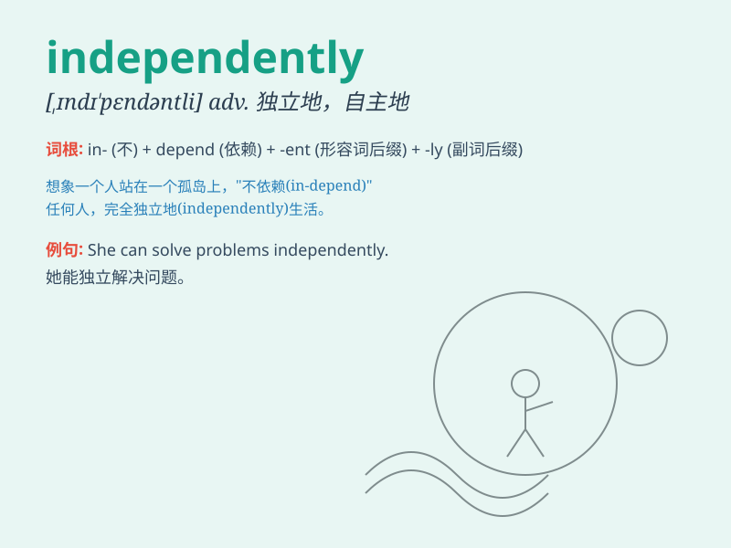

## independently

**英音:** _[,ɪndɪ\'pend(ə)ntlɪ]_ **美音:**
_[,ɪndɪ\'pɛndəntli]_

**译义:** *adv.独立地,自立地*

### 短语

+ **act independently:** _独立行动_

+ **think independently:** _独立思考_

+ **live independently:** _独立生活_

+ **work independently:** _独立工作_

+ **study independently:** _自主学习_

### 例句

#### 例句1

> **She works independently and rarely asks for help.**

**中文翻译:** 她独立工作，很少寻求帮助。

**单词释义:** 独立地

#### 例句2

> **The children are encouraged to think independently.**

**中文翻译:** 鼓励孩子独立思考。

**单词释义:** 独立地

#### 例句3

> **The two departments operate independently of each other.**

**中文翻译:** 这两个部门相互独立运作。

**单词释义:** 独立地

### 背诵小故事

> A young adventurer set off on a journey independently. He faced many
challenges but relied on his own skills and decisions. Finally, he
achieved his goal and became a hero. This shows the meaning of
\'independently\' - alone and without relying on others.

**一位年轻的冒险家独自踏上旅程。他面临诸多挑战，但依靠自己的技能和决定。最终，他达成目标并成为英雄。这展现了\'independently\'（独立地；自主地）的含义------独自一人且不依赖他人。**

### 图义

