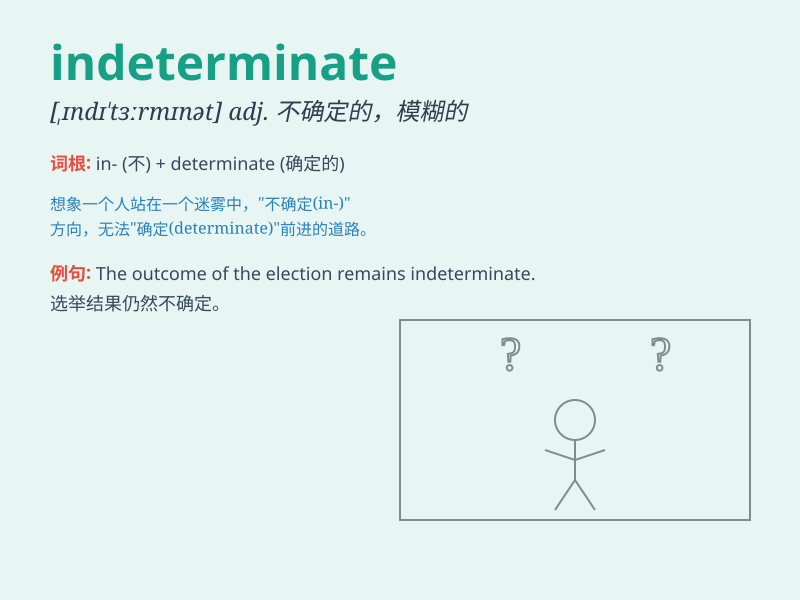

## indeterminate

**英音:** _[,ɪndɪ\'tɜːmɪnət]_ **美音:**
_[\'ɪndɪ\'tɝmənət]_

**译义:** *adj.不确的,不确定的,模糊的*

### 短语

+ **indeterminate form:** _不定型；未定式_

+ **indeterminate equation:** _不定方程_

+ **indeterminate growth:** _不定生长_

+ **indeterminate coefficient:** _不定系数_

+ **indeterminate period:** _不确定时期；未定期限_

### 例句

#### 例句1

> **The outcome of the experiment was indeterminate.**

**中文翻译:** 实验的结果是不确定的。

**单词释义:** 不确定的

#### 例句2

> **His position on the issue remains indeterminate.**

**中文翻译:** 他在这个问题上的立场仍然不确定。

**单词释义:** 不明确的

#### 例句3

> **The future of the project is indeterminate at the moment.**

**中文翻译:** 目前该项目的未来尚不确定。

**单词释义:** 不确定的

### 背诵小故事

> A scientist was conducting an experiment, but the results were
indeterminate. The data was so confusing that it was impossible to draw
a clear conclusion. It made the scientist very frustrated.

**一位科学家正在进行一项实验，但结果是不确定的。数据非常混乱，以至于无法得出明确的结论。这让科学家非常沮丧。**

### 图义

