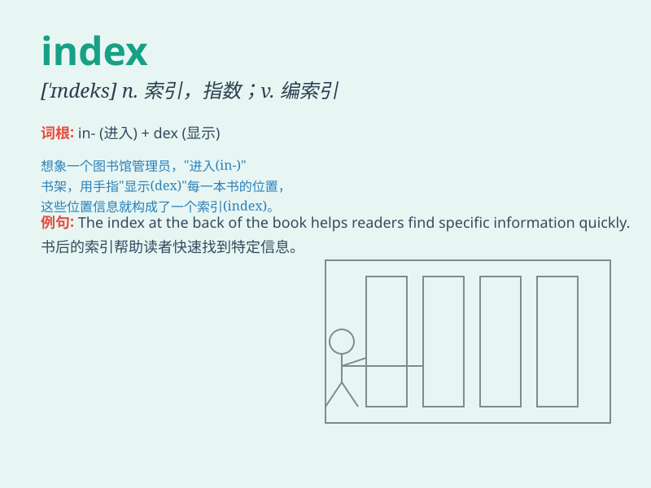

## index

**英音:** _[\'ɪndeks]_ **美音:** _[\'ɪndɛks]_

**译义:**
*n.索引,[数学]指数,指标,(刻度盘上)指针vt.编入索引中,指出vi.做索引*

### 短语

+ **index finger:** _食指_

+ **consumer price index:** _消费价格指数_

+ **stock index:** _股票指数_

+ **index card:** _索引卡_

+ **subject index:** _主题索引_

### 例句

#### 例句1

> **The index of this book points to important information.**

**中文翻译:** 本书的索引指向重要信息。

**单词释义:** 索引

#### 例句2

> **The consumer price index has risen sharply this month.**

**中文翻译:** 本月居民消费价格指数大幅上涨。

**单词释义:** 指数

#### 例句3

> **She indexed all the files for easy reference.**

**中文翻译:** 她为所有文件建立了索引以便于参考。

**单词释义:** 为......编索引

### 背诵小故事

>
想象有一本神秘的魔法书，每一页都有不同的知识。而\'index\'就像是书的目录，通过它能快速找到你想要的那页神奇知识。

**想象有一本魔法书，\'index\'如同其目录，能助你快速找到所需知识。**

### 图义

