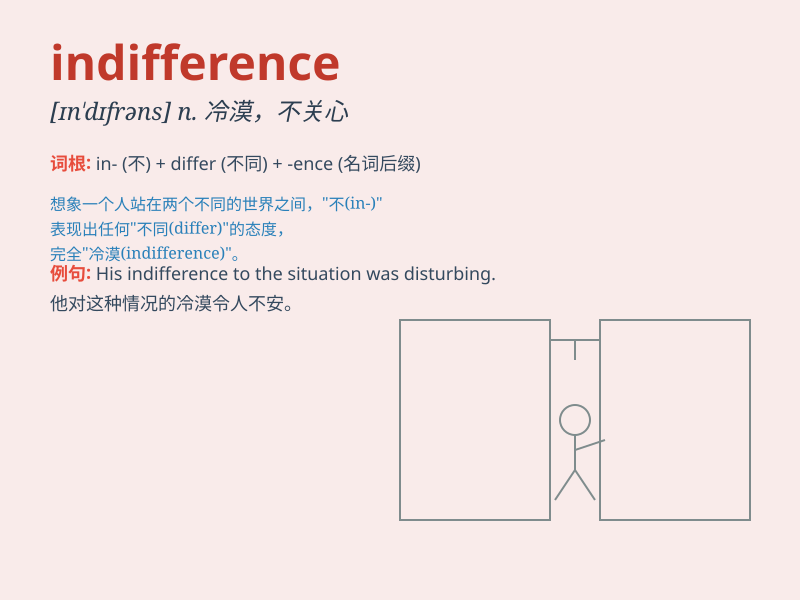

## indifference

**英音:** _[ɪn\'dɪf(ə)r(ə)ns]_ **美音:** _[ɪn\'dɪfrəns]_

**译义:** *n.不关心*

### 短语

+ **show indifference:** _表现出冷漠_

+ **indifference to:** _对\...\...漠不关心_

+ **with indifference:** _冷漠地_

+ **total indifference:** _完全漠不关心_

+ **utter indifference:** _极度冷漠_

### 例句

#### 例句1

> **He showed indifference to her plea for help.**

**中文翻译:** 他对她的求助表现出漠不关心。

**单词释义:** 漠不关心；冷淡

#### 例句2

> **The public\'s indifference to the issue was surprising.**

**中文翻译:** 公众对这个问题的漠不关心令人惊讶。

**单词释义:** 冷漠；不感兴趣

#### 例句3

> **Her indifference made him feel unwanted.**

**中文翻译:** 她的冷漠让他感到不受欢迎。

**单词释义:** 冷淡；不在乎

### 背诵小故事

> A traveler got lost in a strange town. When asking for directions,
people showed indifference, just passing by without helping. This made
the traveler feel very sad.

**一位旅行者在一个陌生的城镇迷路了。当他问路时，人们表现出冷漠，只是路过而不帮忙。这让旅行者感到非常伤心。**

### 图义

