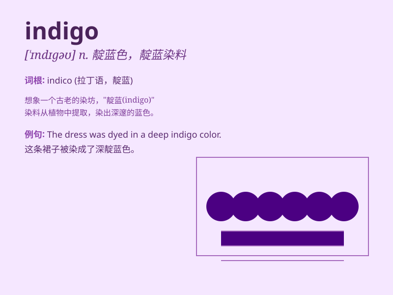

## indigo

**英音:** _[\'ɪndɪgəʊ]_ **美音:** _[\'ɪndɪɡo]_

**译义:** *n.靛,靛青*

### 短语

+ **indigo plant:** _靛蓝植物_

+ **indigo dye:** _靛蓝染料_

+ **indigo blue:** _靛蓝色_

+ **indigo extract:** _靛蓝提取物_

+ **indigo solution:** _靛蓝溶液_

### 例句

#### 例句1

> **The sky turned indigo as the sun set.**

**中文翻译:** 太阳落山时，天空变成了靛蓝色。

**单词释义:** 靛蓝色

#### 例句2

> **She wore an indigo dress to the party.**

**中文翻译:** 她穿着一件靛蓝色连衣裙去参加聚会。

**单词释义:** 靛蓝色的

#### 例句3

> **The artist mixed indigo with white to create a soft shade.**

**中文翻译:** 艺术家将靛蓝与白色混合，创造出柔和的色调。

**单词释义:** 靛蓝（色）

### 背诵小故事

>
从前有个画家，他一直在寻找一种独特的颜色来完成他的杰作。有一天，他在一个神秘的地方发现了一种深邃而迷人的蓝色，他称其为\'indigo\'，从此，这种颜色让他的画作大放异彩。

**从前有个画家，一直在找一种独特颜色来完成杰作。某天在神秘地方发现深邃迷人的蓝色，称为'靛蓝'，让他的画作大放异彩。**

### 图义

