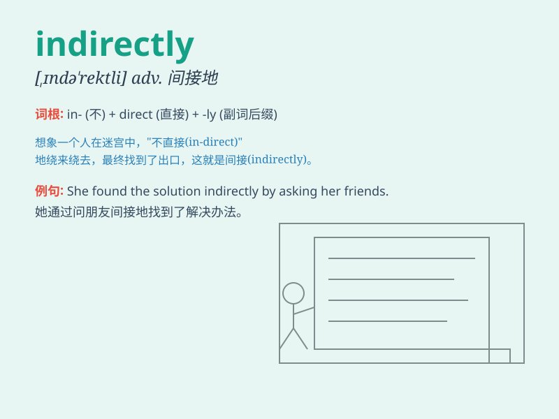

## indirectly

**英音:** _[,ɪndɪ\'rek(t)lɪ]_ **美音:**
_[,ɪndə\'rɛktli]_

**译义:** *adv.间接地,拐弯抹角地*

### 短语

+ **indirectly related:** _间接相关的_

+ **indirectly affected:** _间接受影响的_

+ **indirectly expressed:** _间接表达的_

+ **indirectly involved:** _间接参与的_

+ **indirectly influenced:** _间接受影响的_

### 例句

#### 例句1

> **He indirectly suggested that I was wrong.**

**中文翻译:** 他间接暗示我错了。

**单词释义:** 间接地

#### 例句2

> **The news reached me indirectly through a friend.**

**中文翻译:** 这个消息是通过朋友间接告诉我的。

**单词释义:** 间接地

#### 例句3

> **She indirectly influenced his decision.**

**中文翻译:** 她间接影响了他的决定。

**单词释义:** 间接地

### 背诵小故事

> One day, Tom wanted to find a hidden treasure. But the clues led him
indirectly to a strange cave. He had to follow many detours and
confusing paths. Finally, he found the treasure with patience.

**一天，汤姆想找到一个隐藏的宝藏。但线索间接地把他引向了一个奇怪的洞穴。他不得不走许多弯路和令人困惑的路径。最终，他凭借耐心找到了宝藏。**

### 图义

