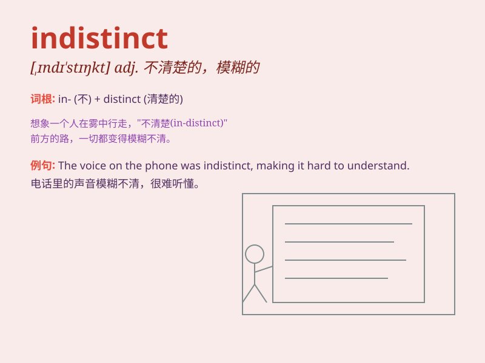

## indistinct

**英音:** _[ɪndɪ\'stɪŋkt]_ **美音:** _[,ɪndɪ\'stɪŋkt]_

**译义:** *adj.不清楚的,模糊的,朦胧的*

### 短语

+ **indistinct vision:** _模糊的视觉_

+ **indistinct sound:** _模糊不清的声音_

+ **indistinct memory:** _模糊的记忆_

+ **indistinct outline:** _模糊的轮廓_

+ **indistinct figure:** _模糊的身影_

### 例句

#### 例句1

> **The distant mountains were indistinct in the fog.**

**中文翻译:** 远处的山在雾气中看不清。

**单词释义:** 模糊的；不清楚的

#### 例句2

> **His speech was indistinct and hard to understand.**

**中文翻译:** 他的讲话含糊其辞，难以理解。

**单词释义:** 不清楚的；难以分辨的

#### 例句3

> **The outline of the figure in the dark was indistinct.**

**中文翻译:** 黑暗中，人影轮廓模糊。

**单词释义:** 不清晰的；朦胧的

### 背诵小故事

> 在一个迷雾弥漫的夜晚，我试图看清远处的建筑，但它们的轮廓 indistinct
模糊不清。我努力睁大眼睛，却还是无法清晰分辨。就好像这些建筑故意隐藏自己，不想被我看清。

**在一个迷雾弥漫的夜晚，我试图看清远处的建筑，但它们模糊不清。我努力睁大眼睛，却还是无法清晰分辨。就好像这些建筑故意隐藏自己，不想被我看清。**

### 图义

