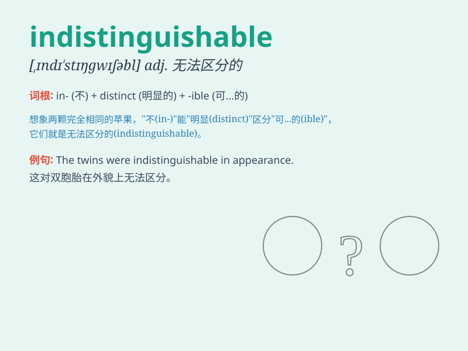

## indistinguishable

**英音:** _[ɪndɪ\'stɪŋgwɪʃəb(ə)l]_ **美音:**
_[\'ɪndɪ\'stɪŋgwɪʃəbl]_

**译义:** * /n.无差眀ly//adv.无差别礔Eb(E)l/adj.不能,不能识别*

### 短语

+ **indistinguishable from:** _与\...\...难以区分_

+ **be indistinguishable:** _难以分辨_

+ **almost indistinguishable:** _几乎难以区分_

+ **seem indistinguishable:** _看起来难以区分_

+ **become indistinguishable:** _变得难以区分_

### 例句

#### 例句1

> **The two paintings were almost indistinguishable from each
other.**

**中文翻译:** 这两幅画几乎无法区分。

**单词释义:** 难以区分的

#### 例句2

> **The counterfeit product was indistinguishable from the genuine
one at first glance.**

**中文翻译:** 乍一看，假冒产品与正品没有什么区别。

**单词释义:** 难以分辨的

#### 例句3

> **In the dim light, the colors of the flowers became
indistinguishable.**

**中文翻译:** 昏暗的灯光下，花朵的颜色变得难以辨认。

**单词释义:** 无法分辨的

### 背诵小故事

> A thief wore a mask that made him indistinguishable from others in
the crowd. The police had a hard time finding him. But in the end, a
small detail gave him away.

**一个小偷戴了个面具，使他在人群中难以区分。警察很难找到他。但最后，一个小细节暴露了他。**

### 图义

