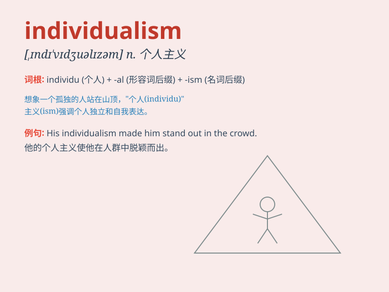

## individualism

**英音:** _[ɪndɪ\'vɪdjʊ(ə)lɪz(ə)m]_ **美音:**
_[,ɪndɪ\'vɪdʒuəlɪzəm]_

**译义:** *n.个人主义,利己主义*

### 短语

+ **rugged individualism:** _顽强的个人主义_

+ **economic individualism:** _经济个人主义_

+ **ethical individualism:** _伦理个人主义_

+ **methodological individualism:** _方法论个人主义_

+ **political individualism:** _政治个人主义_

### 例句

#### 例句1

> **In a society that values individualism, people are encouraged to
express their unique ideas.**

**中文翻译:**
在一个重视个人主义的社会中，人们被鼓励表达自己独特的想法。

**单词释义:** 个人主义

#### 例句2

> **His extreme individualism often leads to conflicts with the
team.**

**中文翻译:** 他极端的个人主义常常导致与团队的冲突。

**单词释义:** 个人主义

#### 例句3

> **The rise of individualism has changed the way people view
success.**

**中文翻译:** 个人主义的兴起改变了人们看待成功的方式。

**单词释义:** 个人主义

### 背诵小故事

> Once upon a time, there was a person who always did things his own
way, not following the crowd. This person believed in expressing his
unique thoughts and feelings. This is individualism - the pursuit of
being oneself and independent.

**从前，有一个人总是按自己的方式做事，不随大流。这个人坚信要表达自己独特的想法和感受。这就是个人主义------追求做自己和独立。**

### 图义

