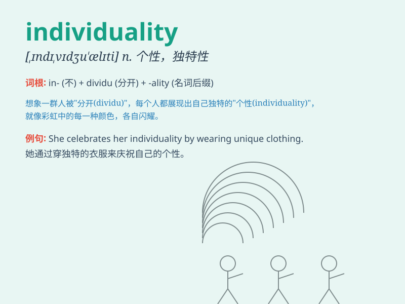

## individuality

**英音:** _[,ɪndɪvɪdjʊ\'ælɪtɪ]_ **美音:**
_[,ɪndɪ,vɪdʒu\'æləti]_

**译义:** *n.个性,个人的特性,(通常用复数)个人的嗜好*

### 短语

+ **express individuality:** _表达个性_

+ **respect individuality:** _尊重个性_

+ **unique individuality:** _独特的个性_

+ **suppress individuality:** _压制个性_

+ **highlight individuality:** _突出个性_

### 例句

#### 例句1

> **She expresses her individuality through her unique fashion
sense.**

**中文翻译:** 她通过独特的时尚感来表达自己的个性。

**单词释义:** 个性；个人特征

#### 例句2

> **The school encourages the development of students\'
individuality.**

**中文翻译:** 学校鼓励学生个性发展。

**单词释义:** 个性

#### 例句3

> **His paintings reflect his strong individuality.**

**中文翻译:** 他的画作体现了他强烈的个性。

**单词释义:** 个性

### 背诵小故事

> There was a small village where everyone dressed and acted the same.
But one person, named Lily, stood out with her unique style and
thoughts. Lily\'s distinctiveness showed her individuality. She was not
afraid to be different.

**在一个小村庄里，每个人的穿着和行为都一样。但有一个叫莉莉的人，以其独特的风格和想法脱颖而出。莉莉的与众不同展现了她的个性。她不怕与众不同。**

### 图义

